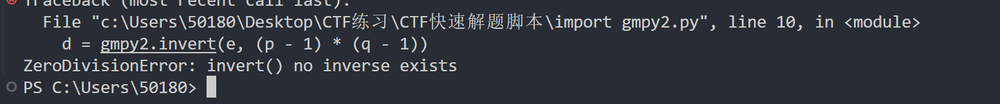

# RSA中e和phi_n不互素

## 题目描述

```python
from secret import flag

p = random_prime(2^128)
q = random_prime(2^128)
n = p * q
e = 65536

m = Integer(flag.hex(), 16)
c = pow(m, e, n)
print(n)
print(c)

'''
3355923238438782367315794268731383721762580031770696441550169781269483561557
3024714280730674139248049746725214418740416860076557280072680498394712377473
'''
```

## 解题思路

### 尝试直接分解p和q

这题的n看着不长，尝试用yafu分解，发现直接可以分解出来

```shell
$ yafu-x64.exe factor(3355923238438782367315794268731383721762580031770696441550169781269483561557)


fac: factoring 3355923238438782367315794268731383721762580031770696441550169781269483561557
fac: using pretesting plan: normal
fac: no tune info: using qs/gnfs crossover of 95 digits
div: primes less than 10000
fmt: 1000000 iterations
rho: x^2 + 3, starting 1000 iterations on C76
rho: x^2 + 2, starting 1000 iterations on C76
rho: x^2 + 1, starting 1000 iterations on C76
pm1: starting B1 = 150K, B2 = gmp-ecm default on C76
ecm: 30/30 curves on C76, B1=2K, B2=gmp-ecm default
ecm: 74/74 curves on C76, B1=11K, B2=gmp-ecm default
ecm: 136/136 curves on C76, B1=50K, B2=gmp-ecm default, ETA: 0 sec

starting SIQS on c76: 3355923238438782367315794268731383721762580031770696441550169781269483561557

==== sieving in progress (1 thread):   30112 relations needed ====
====           Press ctrl-c to abort and save state           ====
30121 rels found: 15343 full + 14778 from 156129 partial, (2950.04 rels/sec)

SIQS elapsed time = 59.2469 seconds.
Total factoring time = 74.8487 seconds


***factors found***

P38 = 20297342154853718314952219089481624063
P39 = 165338063123514818523885615737501133739
```

于是我们分解得到

p=20297342154853718314952219089481624063

q=165338063123514818523885615737501133739

### 看似白给

尝试套用解题脚本：

```python
import gmpy2
from Crypto.Util.number import long_to_bytes
from Crypto.Util.number import bytes_to_long
 
q = 165338063123514818523885615737501133739
p = 20297342154853718314952219089481624063
e = 65536
n = q*p
c = 3024714280730674139248049746725214418740416860076557280072680498394712377473
d = gmpy2.invert(e, (p - 1) * (q - 1))

m = pow(c, d, n)
print(long_to_bytes(m))
```

结果发现报错：

​​

‍

```log
 d = gmpy2.invert(e, (p - 1) * (q - 1))
ZeroDivisionError: invert() no inverse exists
```

搜了一下是因为e和phi不互素，有公因子

### e和phi互素该怎么办

这题的情况，e=65536不算小，尝试`有限域内开方`​，发现很久都跑不出来，所以考虑`有限域内开方`​ 来做.，最后再CRT一下

```python
from Crypto.Util.number import * 
 
q = 165338063123514818523885615737501133739
p = 20297342154853718314952219089481624063
e = 65536
n = q*p
c = 3024714280730674139248049746725214418740416860076557280072680498394712377473

for mp in Zmod(p)(c).nth_root(e, all=True):
    for mq in Zmod(q)(c).nth_root(e, all=True):
        m = crt([ZZ(mp), ZZ(mq)], [p, q])
        try:
            flag = long_to_bytes(m)
            if flag.startswith(b'flag'):
                print(flag)
                print(mp)
                print(mq)
        except:
            pass
```

‍

## 总结

遇到e与phi不互素的问题，首先就考虑问题的复杂程度，从e的大小和e与phi的公约数大小入手。总结出了三个板子针对不同的情况。不过遇到实际的问题还需具体情况具体分析。

### 1.当e较小

```python
from Crypto.Util.number import *
import gmpy2
c = 
e = 
n = 
p = 
q = 
phi = (p - 1) * (q - 1)
t = gmpy2.gcd(e,phi)
print(t)
_e = e // t
d = gmpy2.invert(_e,phi)
_m = pow(c,d,n)
m = gmpy2.iroot(_m,t)[0]
print(long_to_bytes(m))
```

### 2.e不算大(几十几百)但需结合CRT求解

```python
from Crypto.Util.number import *
import gmpy2
p = 
q = 
c = 
n = 
e = 
phi = (p - 1) * (q - 1)

R.<x> = Zmod(p)[]
f = x ^ e - c
f = f.monic()
res1 = f.roots(multiplicities=False)

R.<x> = Zmod(q)[]
f = x ^e - c
f = f.monic()
res2 = f.roots(multiplicities=False)
for i in res1:
    for j in res2:
        ai = [i[0],j[0]]
        mi = [p,q]
        flag = CRT_list(ai,mi)
        flag = long_to_bytes(flag)
        if b'flag' in flag:
            print(flag)
```

### 3.e很大

```python
from Crypto.Util.number import * 
 
q = 165338063123514818523885615737501133739
p = 20297342154853718314952219089481624063
e = 65536
n = q*p
c = 3024714280730674139248049746725214418740416860076557280072680498394712377473

for mp in Zmod(p)(c).nth_root(e, all=True):
    for mq in Zmod(q)(c).nth_root(e, all=True):
        m = crt([ZZ(mp), ZZ(mq)], [p, q])
        try:
            flag = long_to_bytes(m)
            if flag.startswith(b'flag'):
                print(flag)
                print(mp)
                print(mq)
        except:
            pass
```
