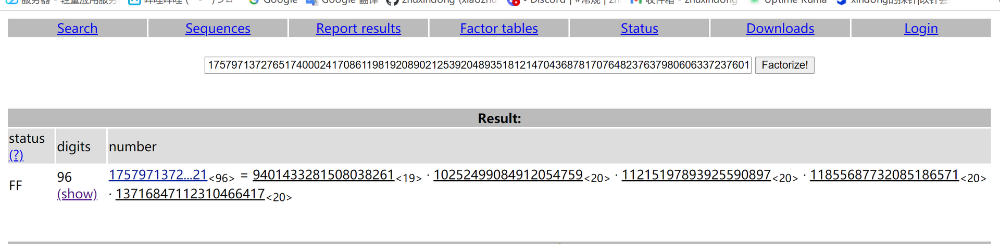

# N可以分解为多个素数
- 关键词 n可以分解为多个素数
## 题目描述
```python
import libnum
from Crypto.Util import number
from functools import reduce
from secret import flag

n = 5
size = 64
while True:
    ps = [number.getPrime(size) for _ in range(n)]
    if len(set(ps)) == n:
        break

e = 65537
n = reduce(lambda x, y: x*y, ps)
m = libnum.s2n(flag)
c = pow(m, e, n)

print('n = %d' % n)
print('c = %d' % c)

#
n = 175797137276517400024170861198192089021253920489351812147043687817076482376379806063372376015921
c = 144009221781172353636339988896910912047726260759108847257566019412382083853598735817869933202168
#
```

首先题目有点看不懂，我是结合chatgpt来阅读题目的，chatgpt给出的回答是：
这段代码看起来是一个简单的RSA加密实现，它使用了一组不同的素数来生成RSA公钥。以下是代码的主要步骤和作用：

1. 导入了必要的库：`libnum` 用于字符串和数字之间的转换，`Crypto.Util.number` 用于生成素数，`functools.reduce` 用于计算一组素数的乘积。

2. 定义了一些变量：
   - `n` 初始化为 5，这个值在后面的循环中可能会改变。
   - `size` 初始化为 64，它表示生成素数的位数。
   - 使用一个无限循环，直到找到 n 个不同的素数为止。

3. 在循环中，使用 `number.getPrime(size)` 生成 n 个大小为 `size` 位的素数，并将它们存储在列表 `ps` 中。

4. 检查生成的素数是否都不相同，如果是，则退出循环，否则继续生成新的素数。

5. 设置 RSA 加密的公钥参数：
   - `e` 被设置为 65537，这是常用的 RSA 公钥指数。
   - `n` 被设置为 `ps` 列表中素数的乘积，即所有素数的乘积。

6. 使用 `libnum.s2n(flag)` 将待加密的明文 `flag` 转换为整数 `m`。

7. 使用 RSA 加密算法的公钥参数 `e` 和 `n`，对明文 `m` 进行加密，结果存储在变量 `c` 中。

8. 最后，打印出生成的公钥参数 `n` 和密文 `c`。

这段代码的目标似乎是要生成一个具有特定的公钥参数 `n` 和对应的密文 `c`，但是代码中没有明确指定 `flag` 的值，因此无法知道具体的明文是什么。要解密密文，你需要知道私钥，包括素数分解 `n` 的因子和私钥指数 `d`。通常，这种情况下，私钥是未知的，因此你需要尝试其他攻击方式来解密。这可能涉及到 RSA 加密的一些已知漏洞或攻击方法，取决于具体情况。

## 解题思路
经过chatgpt这么一说就明白了，这个N是多个素数相乘，而且
这个N一看就不大啊，尝试在factordb.com上直接分解：

在已知N之后，就可以计算$\phi(n)$了
这题有五个质因子，则有
$$ \phi(n) = (p1-1) \cdot (p2-1) \cdot (p3-1) \cdot (p4-1) \cdot (p5-1) $$
注意，如果有素数相同，比如 $n = p^k$，则有
$$ (\phi(n) = (p^{k-1})(p-1)) $$

## 解题脚本
接下来就简单了，解题脚本如下：
```python
import libnum

# 给定的公钥参数
n = 175797137276517400024170861198192089021253920489351812147043687817076482376379806063372376015921
c = 144009221781172353636339988896910912047726260759108847257566019412382083853598735817869933202168

# 分解 n，找到素因子
factors = [ 9401433281508038261,10252499084912054759,11215197893925590897,11855687732085186571,13716847112310466417]

# 计算 phi(n)
phi_n = 1
for factor in factors:
    phi_n *= (factor - 1)

# 选择私钥指数 d
d = libnum.invmod(65537, phi_n)

# 使用私钥指数 d 解密密文
m = pow(c, d, n)

# 将解密后的整数转换回字符串
flag = libnum.n2s(m)
print(flag)
```

运行结果为：
```
b'HSCTF{@Tv0_br3ad5_c1ip_cHe3se_!@}'
```
