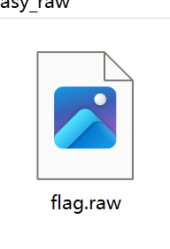
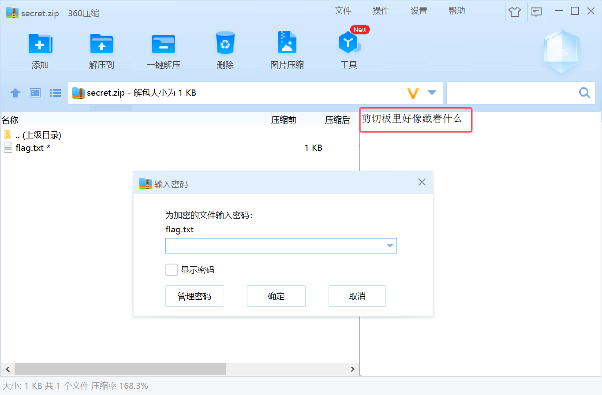
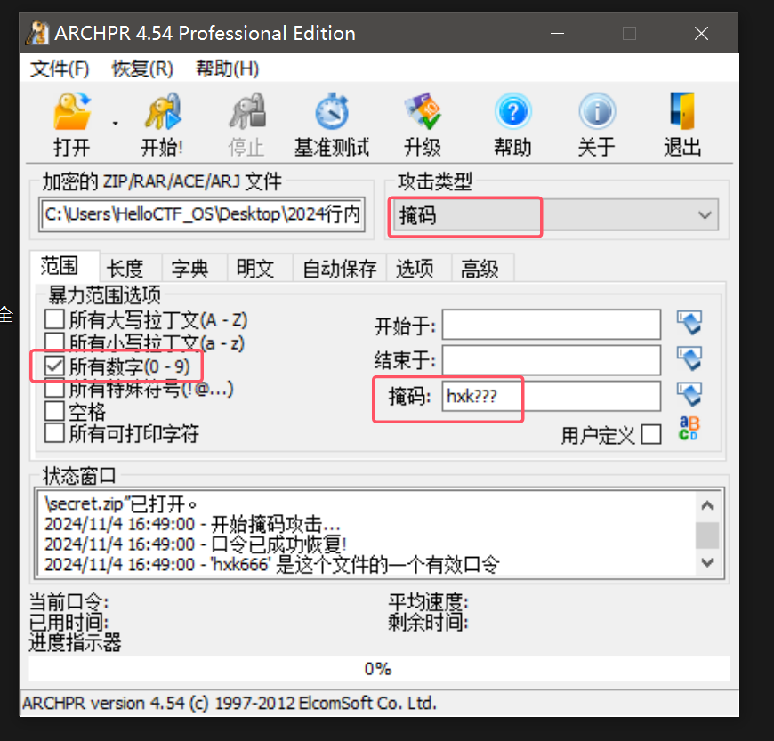
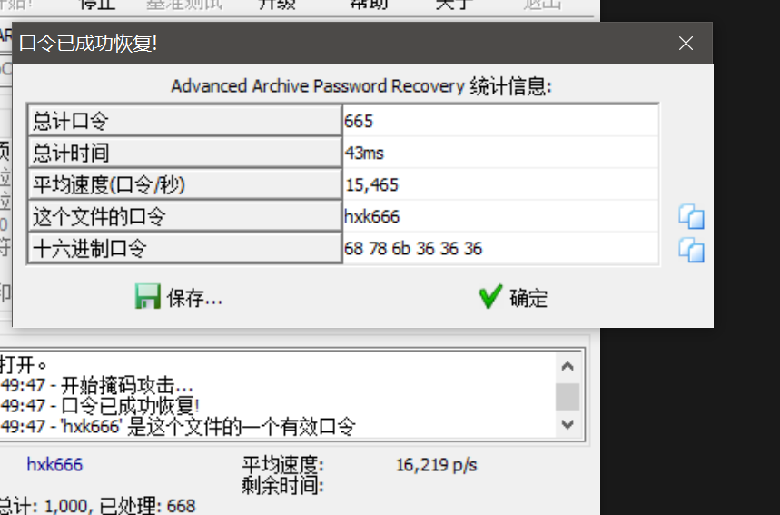
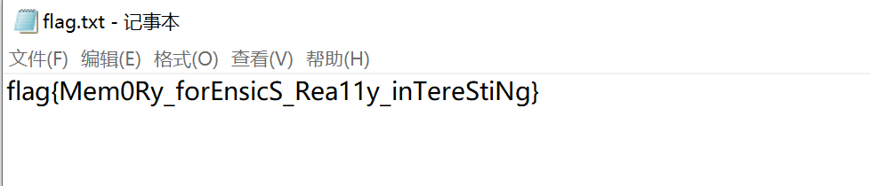

# windows内存取证1

## 题目描述

就给了一个flag.raw

​​

## 解题步骤

### 1.volatility查看基本信息

```shell
volatility.exe -f flag.raw imageinfo
```

显示

```log
$ volatility.exe -f flag.raw imageinfo
Volatility Foundation Volatility Framework 2.6
INFO    : volatility.debug    : Determining profile based on KDBG search...
          Suggested Profile(s) : Win7SP1x64, Win7SP0x64, Win2008R2SP0x64, Win2008R2SP1x64_23418, Win2008R2SP1x64, Win7SP1x64_23418
                     AS Layer1 : WindowsAMD64PagedMemory (Kernel AS)
                     AS Layer2 : FileAddressSpace (C:\Users\50180\Desktop\业研全行安全竞赛\附件汇总\easy_r
aw\flag.raw)
                      PAE type : No PAE
                           DTB : 0x187000L
                          KDBG : 0xf8000400d0a0L
          Number of Processors : 1
     Image Type (Service Pack) : 1
                KPCR for CPU 0 : 0xfffff8000400ed00L
             KUSER_SHARED_DATA : 0xfffff78000000000L
           Image date and time : 2024-10-23 03:14:50 UTC+0000
     Image local date and time : 2024-10-23 11:14:50 +0800
```

### 2.查看进程

```shell
vol.exe -f flag.raw --profile=Win7SP1x64 pslist
```

显示

```shell
$ volatility.exe -f flag.raw --profile=Win7SP1x64 pslist
Volatility Foundation Volatility Framework 2.6
Offset(V)          Name                    PID   PPID   Thds     Hnds   Sess  Wow64 Start
         Exit
------------------ -------------------- ------ ------ ------ -------- ------ ------ ------------------------------ ------------------------------
0xfffffa80018d0b30 System                    4      0     81      479 ------      0 2024-10-23 03:13:00 UTC+0000
0xfffffa8001e81820 smss.exe                236      4      2       32 ------      0 2024-10-23 03:13:00 UTC+0000
0xfffffa800224c060 csrss.exe               312    296      9      319      0      0 2024-10-23 03:13:00 UTC+0000
0xfffffa80018dc910 wininit.exe             360    296      3       77      0      0 2024-10-23 03:13:00 UTC+0000
0xfffffa80018df690 csrss.exe               368    352      7       78      1      0 2024-10-23 03:13:00 UTC+0000
0xfffffa8002e16190 winlogon.exe            396    352      5      100      1      0 2024-10-23 03:13:00 UTC+0000
0xfffffa8002e503e0 services.exe            452    360      8      171      0      0 2024-10-23 03:13:00 UTC+0000
0xfffffa8002e5ab30 lsass.exe               468    360      8      714      0      0 2024-10-23 03:13:01 UTC+0000
0xfffffa8002e57b30 lsm.exe                 476    360     11      227      0      0 2024-10-23 03:13:01 UTC+0000
0xfffffa8002eb33c0 svchost.exe             568    452     11      347      0      0 2024-10-23 03:13:01 UTC+0000
0xfffffa8002ed3570 svchost.exe             636    452      7      240      0      0 2024-10-23 03:13:01 UTC+0000
0xfffffa8002f00b30 svchost.exe             712    452     20      377      0      0 2024-10-23 03:13:01 UTC+0000
0xfffffa8002f0ab30 LogonUI.exe             724    396      8      191      1      0 2024-10-23 03:13:01 UTC+0000
0xfffffa8002f30a30 svchost.exe             792    452     22      515      0      0 2024-10-23 03:13:01 UTC+0000
0xfffffa8002f419a0 svchost.exe             820    452     36      857      0      0 2024-10-23 03:13:01 UTC+0000
0xfffffa8002f7b390 audiodg.exe             912    712      7      122      0      0 2024-10-23 03:13:01 UTC+0000
0xfffffa8002fb2960 svchost.exe            1000    452     14      268      0      0 2024-10-23 03:13:01 UTC+0000
0xfffffa8002ff3340 svchost.exe             276    452     24      528      0      0 2024-10-23 03:13:01 UTC+0000
0xfffffa800305e400 spoolsv.exe            1048    452     13      311      0      0 2024-10-23 03:13:01 UTC+0000
0xfffffa8003079440 svchost.exe            1076    452     20      320      0      0 2024-10-23 03:13:01 UTC+0000
0xfffffa80031d05f0 svchost.exe            1468    452      5       98      0      0 2024-10-23 03:13:02 UTC+0000
0xfffffa8001ce5910 explorer.exe           1164   1628     44      885      2      0 2024-10-23 03:13:14 UTC+0000
0xfffffa8003320250 SearchIndexer.         1964    452     14      585      0      0 2024-10-23 03:13:19 UTC+0000
0xfffffa80031a9b30 notepad.exe            2760   1164      1       53      2      0 2024-10-23 03:13:59 UTC+0000
0xfffffa8002565b30 dllhost.exe            2932    568      6       80      2      0 2024-10-23 03:14:49 UTC+0000
0xfffffa80025da240 dllhost.exe            2976    568      6       80      0      0 2024-10-23 03:14:49 UTC+0000
0xfffffa800313e060 DumpIt.exe             3008   1164      2       45      2      1 2024-10-23 03:14:50 UTC+0000
0xfffffa8002e2c3e0 conhost.exe            3020   1824      2       41      2      0 2024-10-23 03:14:50 UTC+0000
```

### 3.其中notepad.exe可能有线索，尝试导出dmp文件

```shell
volatility.exe -f flag.raw --profile=Win7SP1x64 memdump -p 2760 -D ./
```

然后springs命令查看一下：

```shell
strings -e l 2760.dmp | grep flag
```

显示:

```shell
$ strings -e l 2760.dmp | grep flag
windows_tracing_flags=3
windows_tracing_flags
flag{flag is not here,but i can tell you there is a secret in the file}
flag{flag is not here,but i can tell you there is a secret in the file}
Allow flag to be passed with CreateFile call that indicates to perform downgrade if applicable.
thread_flags
activation_flags
thread_flags
activation_flags
flags
flags
flag{flag is not here,but i can tell you there is a secret in the file}
Repairing the flags for file record 0x%1.
The file attributes flag 0x%1 in file 0x%3 is incorrect.
The sparse flag in the standard information attribute in file 0x%1
The sparse flag in the standard information attribute in file 0x%1
The old encrypted flag is being replaced by the new encrypted flag
The encrypted flag in standard information attribute in file 0x%1
The reparse flag in standard information attribute in file 0x%1
The reparse flag in standard information attribute in file 0x%1
The sparse flag of attribute of type 0x%1 and name %2 in file
Cleaning up encrypted flag for file 0x%1.
Cleaning up sparse flag for file 0x%1.
Repairing the flags for file record 0x%1.
The file attributes flag 0x%1 in file 0x%3 is incorrect.
The sparse flag in the standard information attribute in file 0x%1
The sparse flag in the standard information attribute in file 0x%1
The old encrypted flag is being replaced by the new encrypted flag
The encrypted flag in standard information attribute in file 0x%1
The reparse flag in standard information attribute in file 0x%1
The reparse flag in standard information attribute in file 0x%1
The sparse flag of attribute of type 0x%1 and name %2 in file
Cleaning up encrypted flag for file 0x%1.
Cleaning up sparse flag for file 0x%1.
windows_tracing_flags=3
windows_tracing_flags=3
windows_tracing_flags=3
windows_tracing_flags=3
flag.txt
flag1.raw
flag1.raw
flag.txt
\flag1.raw
\flag.txt
\flag.txt
```

关注`flag{flag is not here,but i can tell you there is a secret in the file}`

### 4.尝试查找文件secret/flag/zip等

```shell
volatility.exe -f flag.raw --profile=Win7SP1x64  filescan | grep secret
```

没想到直接找到了：

```shell
$ volatility.exe -f flag.raw --profile=Win7SP1x64  filescan | grep secret
Volatility Foundation Volatility Framework 2.6
0x000000007f038f20     16      0 RW---- \Device\HarddiskVolume1\Users\hxk\Desktop\secret.zip
0x000000007f0d4f20     16      0 RW---- \Device\HarddiskVolume1\Users\hxk\Desktop\secret.zip
0x000000007f170f20     16      0 RW---- \Device\HarddiskVolume1\Users\hxk\Desktop\secret.zip
```

### 5.导出文件

```shell
volatility.exe -f flag.raw --profile=Win7SP1x64 dumpfiles -Q 0x000000007f038f20 -D ./
```

导出之后需要自己重命名一下为secret.zip

解压发现有密码，同时显示“剪切板里好像藏着什么”

​​

‍

### 6.查看剪切板并爆破密码

```shell
volatility.exe -f flag.raw --profile=Win7SP1x64 clipboard
```

显示

```shell
$ volatility.exe -f flag.raw --profile=Win7SP1x64 clipboard
Volatility Foundation Volatility Framework 2.6
Session    WindowStation Format                         Handle Object             Data

---------- ------------- ------------------ ------------------ ------------------ --------------------------------------------------
         2 WinSta0       CF_UNICODETEXT               0x3101ff 0xfffff900c01cd100 the key is username+common number
         2 WinSta0       CF_TEXT                          0x10 ------------------

         2 WinSta0       0x3001f9L              0x200000000000 ------------------

         2 WinSta0       CF_TEXT                           0x1 ------------------

         2 ------------- ------------------           0x3001f9 0xfffff900c0fe8740
```

提示the key is username+common number

考虑到用户名是hxk，尝试掩码爆破（hxk?/hxk??/hxk???/hxk????）

最后再hxk???爆破出密码是hxk666

​​

​​

‍

## flag

​​
