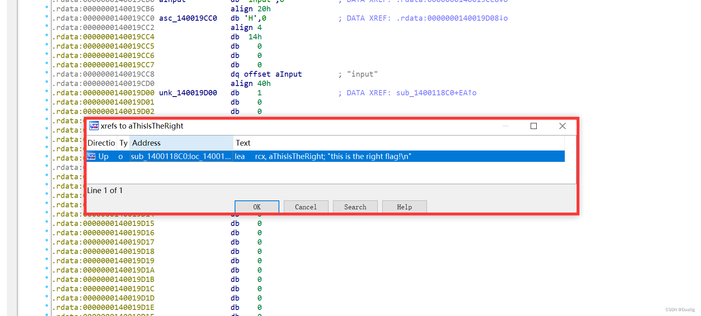
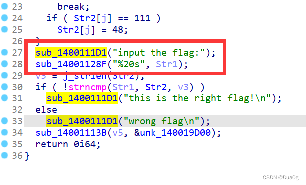

# BUUCTF-reverse1

## 题目基本情况

拿到题目先查下壳（这里用的DIE，网上可以搜到下载）

&nbsp;64位，没有壳（壳是对代码的加密，起混淆保护的作用，一般用来阻止逆向）

## 解题思路
然后拖进[IDA](https://so.csdn.net/so/search?q=IDA&spm=1001.2101.3001.7020)(64位)进行反汇编

一般来说，先查看一下字符串，简单的题目会有flag或者敏感数据字符等信息，方便我们定位函数查看字符串的方法为shift+F12

找到了关于flag的信息，双击点进去找到这段字符串的位置

ctrl+x（交叉引用）查看是哪段函数调用了该字符串

点击“OK”进入该段程序，查看汇编代码

汇编代码对于初学者来说读懂比较困难，可以按“F5”查看伪C代码

代码界面如图

下面是详细解读：

第一步，定位 

一是定位加密后的flag字符串，而是准确定位加密的函数（如何加密的flag）

一般来说，是先去找引用"flag"的代码段，然后一步步定位到关键部分，找到真正把flag加密的函数，然后手工逆向或者写解密脚本得到真正的flag

第二步，手搓或者写脚本逆向（有些简单的加密方式可以直接手算，节省时间）

大部分题目逆向脚本建议用python写，语法比较简单，写起来比较快

回归正题：

先定位"this is the right flag"代码段

不难猜测 "sub\_1400111D1"是"printf"之类的输出函数。

[strncmp](https://so.csdn.net/so/search?q=strncmp&spm=1001.2101.3001.7020)(str1,str2,v3)是把str1与str2两字符串的前v3位数做一个比较，若str1=str2，返回0；大于返回正数，小于返回负数

if（！strncmp（str1，str2，v3））是一个判断语句，if（）括号里面的内容如果为真，则输出

"this is the right flag"，这时我们只需要知道什么情况为真。

然后看括号里面的内容 !( strncmp(str1,str2,v3) )为真的情况

！为非，所以只要( strncmp(str1,str2,v3) )为0， !( strncmp(str1,str2,v3) )即为真；为0的情况已经在上面对strncmp函数的讲解说过了，str1，str2两个字符串相等返回值即为0。

继续往上分析

&nbsp;

前面已经讲过sub\_1400111D1是print函数，不难猜测sub\_14001128F是scanf函数，所以字符串str1为我们输入的内容。接下来看字符串str2.

随便找一个str2，双击点进去之后就找到了str2 '{hello\_world}'

别忘了我们的程序还没有分析完，继续往上分析

&nbsp;

&nbsp;for循环是对str2做了一个转换的处理，str2里面ascii码为111的字符会被转换为ascii码为48的字符，在IDA中，选中数字按"R"键可以将数字转换为字符。

即str2中所有的"o"都被转换成了"0" 

所以flag为 flag{hell0\_w0rld}

此题写的非常详细，初衷是最近想起了刚刚入门时候找遍wp都没有详细的，基础也很差，废了很大功夫才做出来一道题。于是就写了这样一篇面对基础的wp，以后也会持续更新buuctf及各平台的wp，不过没有这篇这么详细了。

