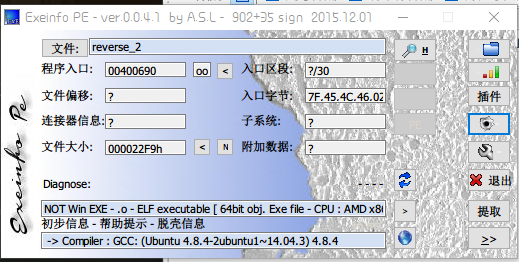
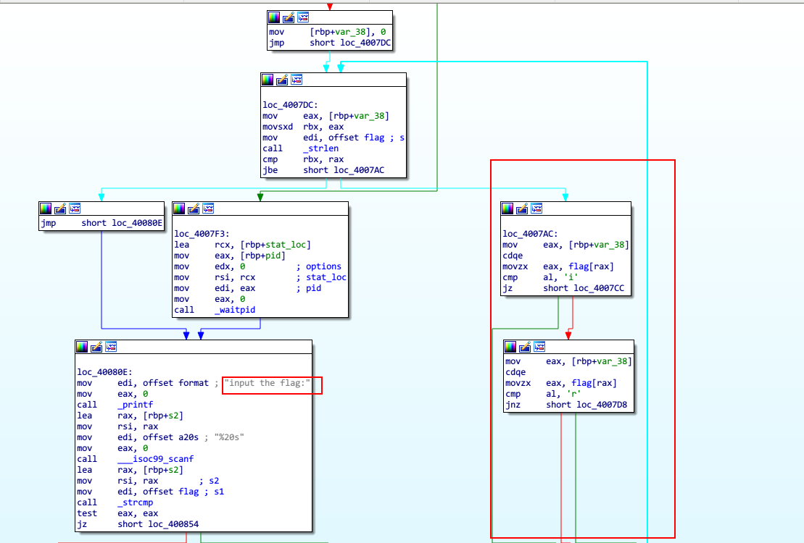
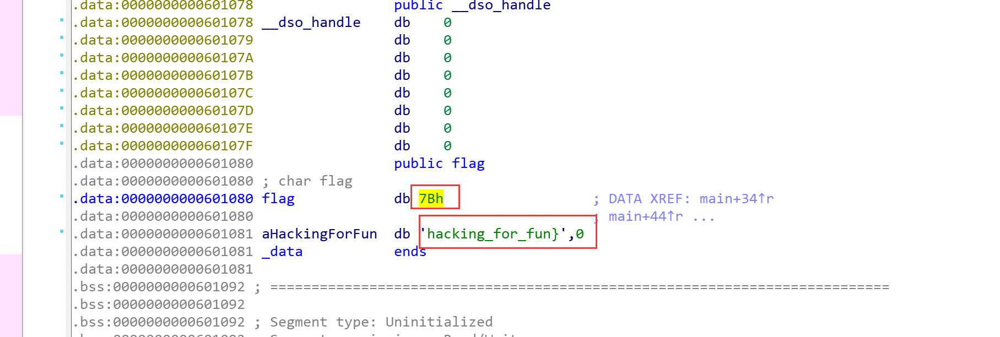
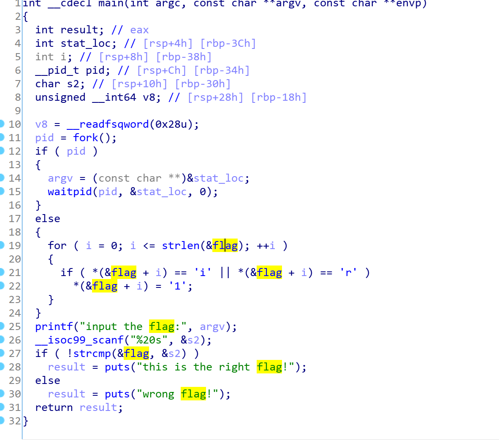

# BUUCTF--reverse2

## 1.题目描述



获取信息

1.  64位文件
2.  可用IDA反编译C文件

&nbsp;

## 2.IDA打开

打开main函数



左边在验证flag，右边很明显在对flag进行变换。看不懂的话可以按F5进入伪代码。
进入flag变量我们能够看到 (**在IDA中，选中数字按"R"键可以将数字转换为字符**)

```
.data:0000000000601080                 public flag
.data:0000000000601080 ; char flag
.data:0000000000601080 flag            db '{'                  ; DATA XREF: main+34↑r
.data:0000000000601080                                         ; main+44↑r ...
.data:0000000000601081 aHackingForFun  db 'hacking\_for\_fun}',0
.data:0000000000601081 \_data           ends
.data:0000000000601081
```


很明显了，就是对{hacking\_for\_fun}进行变换

&nbsp;

### 2.1代码分析

将汇编代码反汇编为C代码



```c
 1 int \_\_cdecl main(int argc, const char \*\*argv, const char \*\*envp)
 2 {
 3   int result; // eax
 4   int stat\_loc; // \[rsp+4h\] \[rbp-3Ch\]
 5   int i; // \[rsp+8h\] \[rbp-38h\]
 6   \_\_pid\_t pid; // \[rsp+Ch\] \[rbp-34h\]
 7   char s2; // \[rsp+10h\] \[rbp-30h\]
 8   unsigned \_\_int64 v8; // \[rsp+28h\] \[rbp-18h\]
 9 
10   v8 = \_\_readfsqword(0x28u);
11   pid = fork();
12   if ( pid )
13 {
14     argv = (const char \*\*)&stat\_loc;
15     waitpid(pid, &stat\_loc, 0);
16 }
17   else
18 {
19     for ( i = 0; i <= strlen(&flag); ++i )
20 {
21       if ( \*(&flag + i) == 'i' || \*(&flag + i) == 'r' )
22         \*(&flag + i) = '1';
23 }
24 }
25   printf("input the flag:", argv);
26   \_\_isoc99\_scanf("%20s", &s2);
27   if ( !strcmp(&flag, &s2) )
28     result = puts("this is the right flag!");
29   else
30     result = puts("wrong flag!");
31   return result;
32 }
```


在18~24行代码，我们很明显能够看到在遍历整个`{hacking_for_fun}`，将'i'和‘r’字符替换为1


## 3.get flag!

 `flag{hack1ng_fo1_fun}`

