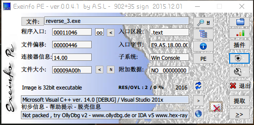
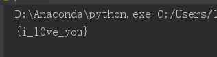

# BUUCTF--reverse3


## 1.题目描述



获得信息

1.  32位文件


## 2.解题思路

将main函数反编译为C语言代码

```c
int \_\_cdecl main(int argc, const char \*\*argv, const char \*\*envp)
{
  int v3; // ebx
  int v4; // edi
  int v5; // esi

  return main\_0(v3, v4, v5);
}
```


打开main\_0函数

```c
 1 \_\_int64 \_\_usercall main\_0@&lt;edx:eax&gt;(int a1@&lt;ebx&gt;, int a2@&lt;edi&gt;, int a3@&lt;esi&gt;)
 2 {
 3   int v3; // eax
 4   const char \*v4; // eax
 5   size\_t v5; // eax
 6   int v6; // edx
 7   \_\_int64 v7; // ST08\_8
 8   signed int j; // \[esp+DCh\] \[ebp-ACh\]
 9   signed int i; // \[esp+E8h\] \[ebp-A0h\]
10   signed int v11; // \[esp+E8h\] \[ebp-A0h\]
11   char Dest\[108\]; // \[esp+F4h\] \[ebp-94h\]
12   char Str; // \[esp+160h\] \[ebp-28h\]
13   char v14; // \[esp+17Ch\] \[ebp-Ch\]
14 
15   for ( i = 0; i < 100; ++i )
16 {
17     if ( (unsigned int)i >= 0x64 )
18 j\_\_\_\_report\_rangecheckfailure(a1, a2, a3);
19     Dest\[i\] = 0;
20 }
21   sub\_41132F("please enter the flag:");
22   sub\_411375("%20s", &Str);
23   v3 = j\_strlen(&Str);
24   v4 = (const char \*)sub\_4110BE((int)&Str, v3, (int)&v14);
25   strncpy(Dest, v4, 0x28u);
26   v11 = j\_strlen(Dest);
27   for ( j = 0; j < v11; ++j )
28     Dest\[j\] += j;
29   v5 = j\_strlen(Dest);
30   if ( !strncmp(Dest, Str2, v5) )
31     sub\_41132F("rigth flag!\\n");
32   else
33     sub\_41132F("wrong flag!\\n");
34   HIDWORD(v7) = v6;
35   LODWORD(v7) = 0;
36   return v7;
37 }
```


### 2.1代码分析

第24行代码，第27~28行代码在对Dest进行一些列变换

从第30行代码分析得到，Str2中存储的就是flag变换过后的字符串，打开Str2
```
.data:0041A034 ; char Str2\[\]
.data:0041A034 Str2            db 'e3nifIH9b\_C@n@dH',0 ; DATA XREF: \_main\_0+142↑o
```
因此，我们只需要将Str2反向变换即可得到flag。

第27~28行代码的变换没有难度，再来看看第24行代码的函数。
```c
 1 void \*\_\_cdecl sub\_411AB0(char \*a1, unsigned int a2, int \*a3)
 2 {
 3   int v4; // STE0\_4
 4   int v5; // STE0\_4
 5   int v6; // STE0\_4
 6   int v7; // \[esp+D4h\] \[ebp-38h\]
 7   signed int i; // \[esp+E0h\] \[ebp-2Ch\]
 8   unsigned int v9; // \[esp+ECh\] \[ebp-20h\]
 9   int v10; // \[esp+ECh\] \[ebp-20h\]
10   signed int v11; // \[esp+ECh\] \[ebp-20h\]
11   void \*Dst; // \[esp+F8h\] \[ebp-14h\]
12   char \*v13; // \[esp+104h\] \[ebp-8h\]
13 
14   if ( !a1 || !a2 )
15     return 0;
16   v9 = a2 / 3;
17   if ( (signed int)(a2 / 3) % 3 )
18     ++v9;
19   v10 = 4 \* v9;
20   \*a3 = v10;
21   Dst = malloc(v10 + 1);
22   if ( !Dst )
23     return 0;
24   j\_memset(Dst, 0, v10 + 1);
25   v13 = a1;
26   v11 = a2;
27   v7 = 0;
28   while ( v11 > 0 )
29 {
30     byte\_41A144\[2\] = 0;
31     byte\_41A144\[1\] = 0;
32     byte\_41A144\[0\] = 0;
33     for ( i = 0; i < 3 && v11 >= 1; ++i )
34 {
35       byte\_41A144\[i\] = \*v13;
36       --v11;
37       ++v13;
38 }
39     if ( !i )
40       break;
41     switch ( i )
42 {
43       case 1:
44         \*((\_BYTE \*)Dst + v7) = aAbcdefghijklmn\[(signed int)(unsigned \_\_int8)byte\_41A144\[0\] >> 2\];
45         v4 = v7 + 1;
46         \*((\_BYTE \*)Dst + v4++) = aAbcdefghijklmn\[((byte\_41A144\[1\] & 0xF0) >> 4) | 16 \* (byte\_41A144\[0\] & 3)\];
47         \*((\_BYTE \*)Dst + v4++) = aAbcdefghijklmn\[64\];
48         \*((\_BYTE \*)Dst + v4) = aAbcdefghijklmn\[64\];
49         v7 = v4 + 1;
50         break;
51       case 2:
52         \*((\_BYTE \*)Dst + v7) = aAbcdefghijklmn\[(signed int)(unsigned \_\_int8)byte\_41A144\[0\] >> 2\];
53         v5 = v7 + 1;
54         \*((\_BYTE \*)Dst + v5++) = aAbcdefghijklmn\[((byte\_41A144\[1\] & 0xF0) >> 4) | 16 \* (byte\_41A144\[0\] & 3)\];
55         \*((\_BYTE \*)Dst + v5++) = aAbcdefghijklmn\[((byte\_41A144\[2\] & 0xC0) >> 6) | 4 \* (byte\_41A144\[1\] & 0xF)\];
56         \*((\_BYTE \*)Dst + v5) = aAbcdefghijklmn\[64\];
57         v7 = v5 + 1;
58         break;
59       case 3:
60         \*((\_BYTE \*)Dst + v7) = aAbcdefghijklmn\[(signed int)(unsigned \_\_int8)byte\_41A144\[0\] >> 2\];
61         v6 = v7 + 1;
62         \*((\_BYTE \*)Dst + v6++) = aAbcdefghijklmn\[((byte\_41A144\[1\] & 0xF0) >> 4) | 16 \* (byte\_41A144\[0\] & 3)\];
63         \*((\_BYTE \*)Dst + v6++) = aAbcdefghijklmn\[((byte\_41A144\[2\] & 0xC0) >> 6) | 4 \* (byte\_41A144\[1\] & 0xF)\];
64         \*((\_BYTE \*)Dst + v6) = aAbcdefghijklmn\[byte\_41A144\[2\] & 0x3F\];
65         v7 = v6 + 1;
66         break;
67 }
68 }
69   \*((\_BYTE \*)Dst + v7) = 0;
70   return Dst;
71 }
```


在代码的下部分，可以看到Dest会经过`aAbcdefghijklmn[]`数组的变换，打开此处
```
.rdata:00417B30 aAbcdefghijklmn db 'ABCDEFGHIJKLMNOPQRSTUVWXYZabcdefghijklmnopqrstuvwxyz0123456789+/='
.rdata:00417B30                                         ; DATA XREF: .text:004117E8↑o
.rdata:00417B30                                         ; .text:00411827↑o ...
.rdata:00417B30                 db 0
.rdata:00417B72                 align 4
```
**从'ABCDEFGHIJKLMNOPQRSTUVWXYZabcdefghijklmnopqrstuvwxyz0123456789+/='可以看出，这个函数应该是base64的加密函数，因此只需要解密即可**。

&nbsp;

## 3.脚本获取flag

```python
import base64

str1 \= 'e3nifIH9b\_C@n@dH'
x \= ''
flag \= ''

for j in range(0, len(str1)):
    x += chr(ord(str1\[j\]) - j)

flag \= base64.b64decode(x)
flag \= flag.decode('ASCII')
print(flag)
```



## 4.get flag！

 `flag{i\_l0ve\_you}`
