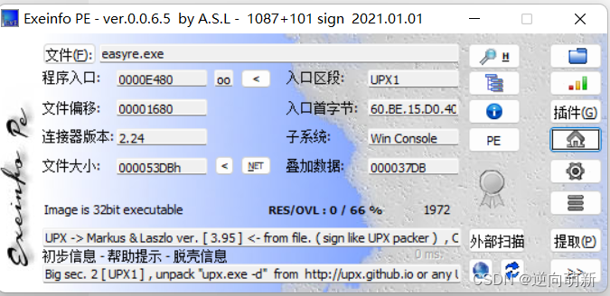
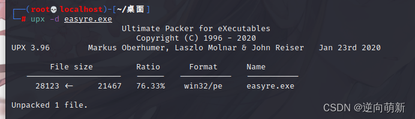
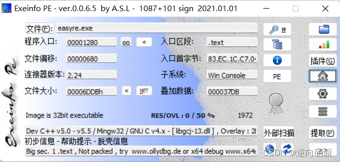
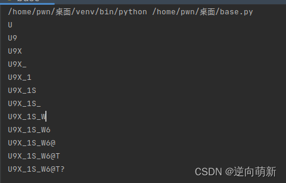

# buuctf-ACTF新生赛2020-easyre


## 解题思路

### 脱壳
这道题拿下来，发现是32位有UPX压缩壳的一个软件。  
  
拖入kali中，进行一次脱壳操作，upx -d 文件名称。  
  
之后拖出来，放入Exeinfo中查看。  
  
发现无壳了，32位的软件。

### 拖入32位[ida](https://so.csdn.net/so/search?q=ida&spm=1001.2101.3001.7020)中查看逻辑

是否有main函数，如果有main查看main函数，如果没有查找运行软件之后第一个显示的字符串，进入了main函数。

```c
`int __cdecl main(int argc, const char **argv, const char **envp) {   char v4; // [esp+12h] [ebp-2Eh]   char v5; // [esp+13h] [ebp-2Dh]   char v6; // [esp+14h] [ebp-2Ch]   char v7; // [esp+15h] [ebp-2Bh]   char v8; // [esp+16h] [ebp-2Ah]   char v9; // [esp+17h] [ebp-29h]   char v10; // [esp+18h] [ebp-28h]   char v11; // [esp+19h] [ebp-27h]   char v12; // [esp+1Ah] [ebp-26h]   char v13; // [esp+1Bh] [ebp-25h]   char v14; // [esp+1Ch] [ebp-24h]   char v15; // [esp+1Dh] [ebp-23h]   int v16; // [esp+1Eh] [ebp-22h]   int v17; // [esp+22h] [ebp-1Eh]   int v18; // [esp+26h] [ebp-1Ah]   __int16 v19; // [esp+2Ah] [ebp-16h]   char v20; // [esp+2Ch] [ebp-14h]   char v21; // [esp+2Dh] [ebp-13h]   char v22; // [esp+2Eh] [ebp-12h]   int v23; // [esp+2Fh] [ebp-11h]   int v24; // [esp+33h] [ebp-Dh]   int v25; // [esp+37h] [ebp-9h]   char v26; // [esp+3Bh] [ebp-5h]   int i; // [esp+3Ch] [ebp-4h]    __main();   v4 = 42;   v5 = 70;   v6 = 39;   v7 = 34;   v8 = 78;   v9 = 44;   v10 = 34;   v11 = 40;   v12 = 73;   v13 = 63;   v14 = 43;   v15 = 64;   printf("Please input:");   scanf("%s", &v19);   if ( (_BYTE)v19 != 65 || HIBYTE(v19) != 67 || v20 != 84 || v21 != 70 || v22 != 123 || v26 != 125 )     return 0;   v16 = v23;   v17 = v24;   v18 = v25;   for ( i = 0; i <= 11; ++i )   {     if ( *(&v4 + i) != _data_start__[*((char *)&v16 + i) - 1] )       return 0;   }   printf("You are correct!");   return 0; }`


```

看到了这个伪代码，进行分析，知道通过v4+i 要等于那一串的字符串`__data\_strart__`中寻找一个字符串，看是否相等，所以反过来要+1，那么代码成立，开始改写代码。

### 改写代码

```c
``v4 = [42,70,39,34,78,44,34,40,73,63,43,64] s = '' flag = '' __data_strart__ = '~}|{zyxwvutsrqponmlkjihgfedcba`_^]\[ZYXWVUTSRQPONMLKJIHGFEDCBA@?>=<;:9876543210/.-,+*)(\'&%$# !"' for i in v4:     s += chr(__data_strart__.find(chr(i))+1)     print(s)``


```

### 得到flag



`flag{U9X\_1S\_W6@T?}`
