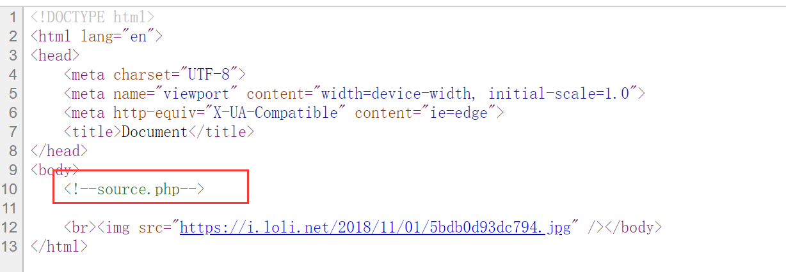
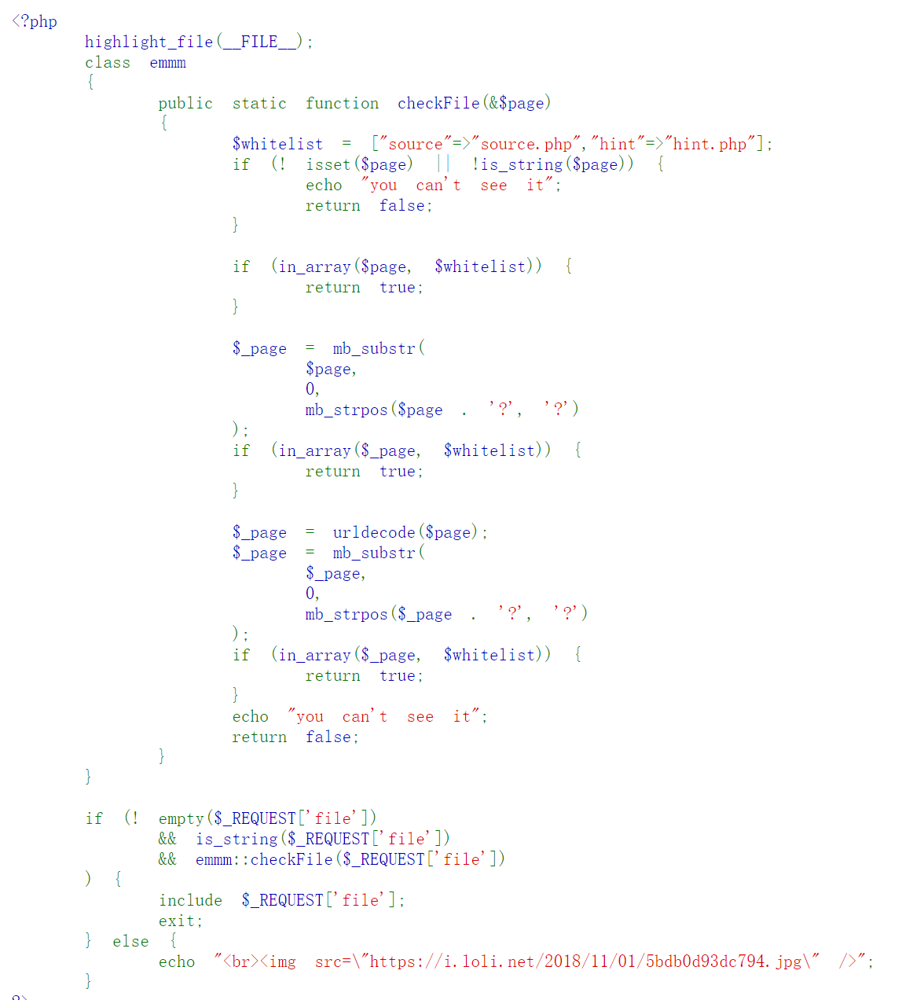
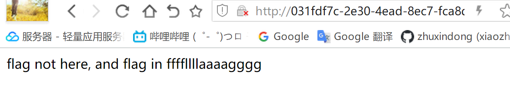

# BUUCTF warmup
## 题目描述


## 解题思路
先看看源码

发现有个source.php
查看source.php的源码：
	
	
```php
<?php
    highlight_file(__FILE__);
    class emmm
    {
        public static function checkFile(&$page)
        {
            $whitelist = ["source"=>"source.php","hint"=>"hint.php"];
            if (! isset($page) || !is_string($page)) {
                echo "you can't see it";
                return false;
            }

            if (in_array($page, $whitelist)) {
                return true;
            }

            $_page = mb_substr(
                $page,
                0,
                mb_strpos($page . '?', '?')
            );
            if (in_array($_page, $whitelist)) {
                return true;
            }

            $_page = urldecode($page);
            $_page = mb_substr(
                $_page,
                0,
                mb_strpos($_page . '?', '?')
            );
            if (in_array($_page, $whitelist)) {
                return true;
            }
            echo "you can't see it";
            return false;
        }
    }

    if (! empty($_REQUEST['file'])
        && is_string($_REQUEST['file'])
        && emmm::checkFile($_REQUEST['file'])
    ) {
        include $_REQUEST['file'];
        exit;
    } else {
        echo "<br>";
    }  
?>
```
查看hint.php
发现
flag应该在 `ffffllllaaaagggg` 中 
仔细审计这段代码：
```
第一个if语句对变量进行检验，要求$page为字符串，否则返回false
第二个if语句判断$page是否存在于$whitelist数组中，存在则返回true
第三个if语句判断$page中?之前的字符串是否存在于$whitelist数组中，存在则返回true
第四个if语句判断$page参数url解密后的$_page中?之前的字符串是否存在于$whitelist数组中，存在则返回true
都不满足，最后返回false
```
从中可以看出，只需要任意一个if返回true即可。
第二个语句直接判断$page，不可用
第一个if语句只要满足了外部函数的if语句这个就不会成立，所以不用管
第四个if语句事多余的，因为只要第三个if语句成立，就会返回true。所以关键在于绕过第三个if。仔细看第三个if：
```php
$_page = mb_substr(//该代码表示截取$page中'?'前部分，若无则截取整个$page
            $page,
            0,
            mb_strpos($page . '?', '?')
        );
if (in_array($_page, $whitelist)) {//若$_page变量存在于$whitelist数组中
            return true;
        }
```
这个时候如果我们在file内容中加入?，就能实现截断的效果，这个时候page将会验证?前方的str是否包含在array中，因此就能实现checkFile函数的绕过。
这个时候一定能过checkFile函数。
但是我们的include文件读取函数却是直接将file进行了读取，这个时候file的内容是无效的，因此什么东西也读不出来。
比如我们如果构造`source.php?ffffllllaaaagggg`
虽然能绕过，但是最后的include函数就不能正确执行，读取不到ffffllllaaaagggg。

这个时候我们就要用到一个关键符号：/
例如：`include 'source.php/flag.txt'`
`source.php`无法被正确读取，这个时候/后面的flag.txt就会被include函数读取并解析
因此我们可以构建payload：
`?file=source.php?/ffffllllaaaagggg`
不过啥反应都没有，我们尝试往上一层目录查找。
最终翻了四层之后，找到了flag，对应的payload为：
`?file=source.php?../../../../../ffffllllaaaagggg`


