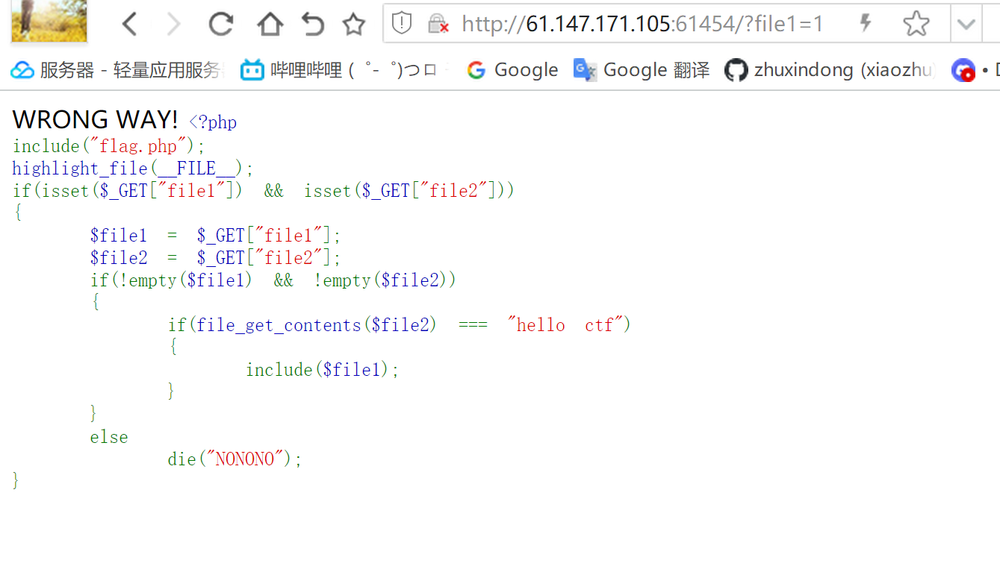

# WEB-攻防世界fileclude
- 关键词  php伪协议读取源码

## 1.题目描述


## 2.解题思路
启动场景可知，flag应该是在flag.php里面，只要能执行include($file1);这一行，就能利用伪协议"php://filter/read=convert.base64-encode/resource=./flag.php" 来读取flag.php的源代码。

- 附php伪协议常用介绍https://blog.csdn.net/qq_51295677/article/details/123462929?utm_medium=distribute.pc_relevant.none-task-blog-2~default~baidujs_baidulandingword~default-0-123462929-blog-132017636.235^v38^pc_relevant_anti_vip&spm=1001.2101.3001.4242.1&utm_relevant_index=1


但实际传入/?file1=php://filter/read=convert.base64-encode/resource=flag.php&file2=hello%20ctf之后发现报错。原因是file_get_contents()这个函数需要传入文件路径，我们没上传文件，所以报错找不到文件。

想办法绕开，网上看了一下： file_get_contents()的$filename参数不仅仅为本地文件路径，还可以是一个网络路径URL， 所以利用伪协议data://text/plain;base64,aGVsbG8gY3Rm （aGVsbG8gY3Rm经过base64解码之后是hello ctf）。


成功得到一个base64编码的字符，解码之后就是flag了


## 3总结
遇到文件包含需要读取源码可以使用php://filter协议，格式如下
```php
读：php://filter/resource=文件名
 
php://filter/read=convert.base64-encode/resource=文件名
 
写：php://filter/resource=文件名&txt=文件内容
 
php://filter/write=convert.base64-encode/resource=文件名&txt=文件内容
```
