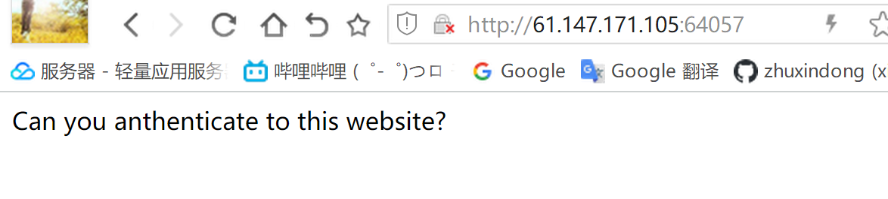
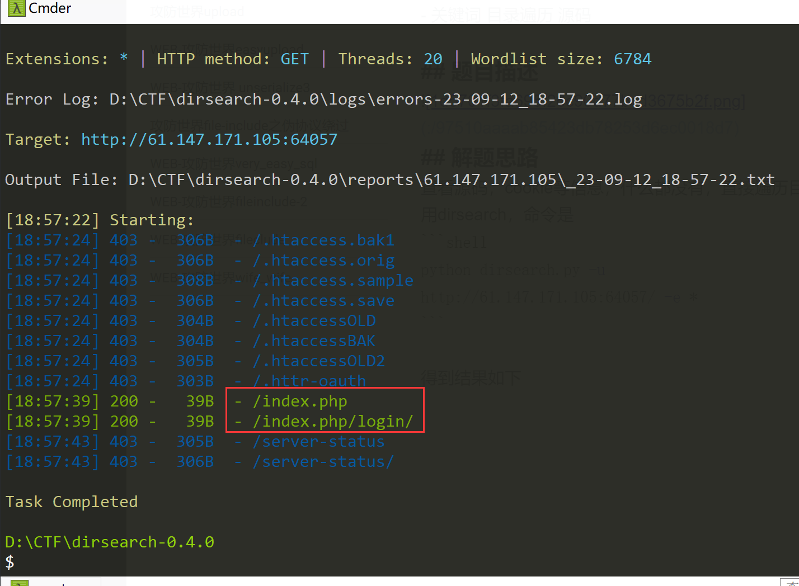
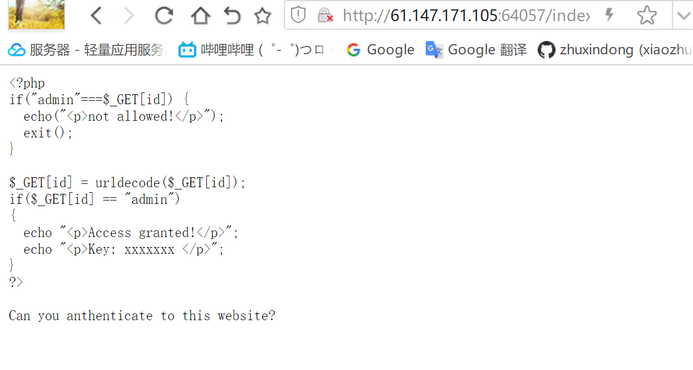
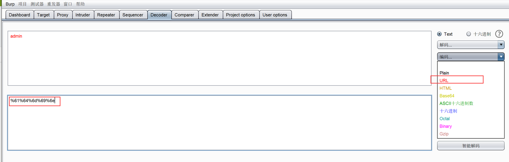
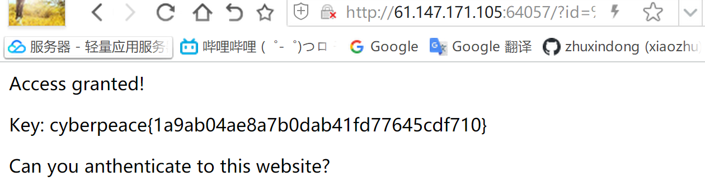

# WEB-攻防世界php2
- 关键词 目录遍历 源码

## 题目描述

## 解题思路
查看源码，cookie等信息，什么都没有，直接遍历目录
用dirsearch，命令是
```shell
python dirsearch.py -u http://61.147.171.105:64057/ -e *
```

得到结果如下

直接访问`http://61.147.171.105:64057/index.php/login/`也是一样的界面，这时候的考点其实是index.phps文件有源码
直接访问`http://61.147.171.105:64057/index.phps`
得到源码


从源码中我们可以看出，考点之一是php中的==。关于php中==和===的区别是：（来源是 chatgpt）

在PHP中，`===` 和 `==` 是两种不同的比较运算符，用于比较两个值的相等性，它们有以下区别：

1. `===`（全等）运算符：
   - `===` 用于比较两个值是否相等且数据类型也相同。
   - 如果两个操作数的值和数据类型都相同，`===` 返回 `true`，否则返回 `false`。
   - 例如：`5 === 5` 会返回 `true`，但 `5 === '5'` 会返回 `false`，因为前者比较的是整数，而后者比较的是整数和字符串。

2. `==`（等于）运算符：
   - `==` 用于比较两个值是否相等，不考虑数据类型。
   - 如果两个操作数的值相等，即使它们的数据类型不同，`==` 也会返回 `true`。
   - 例如：`5 == 5` 会返回 `true`，而 `5 == '5'` 也会返回 `true`，因为它只比较值而不比较数据类型。

要根据你的需求选择使用哪个运算符。如果你要确保两个值不仅相等而且数据类型也相同，应该使用 `===`。如果只关心值是否相等，而不关心数据类型，则可以使用 `==`。

看源码，只需要id的值经过urldecode之后等于admin就行。关于urldecode函数：
urldecode是PHP函数，解码经过URL编码的字符串，解码回原始的形式；URL编码中某些字符被替换为%后跟两个十六进制形式；这是为了确保 URL 中的特殊字符不会与 URL 结构冲突。例如，空格字符在 URL 中被编码为 `%20`，而 `&` 字符被编码为 `%26`，`%`字符被编码为`%25`
所以我们直接将admin转码

这里非常需要注意的一点是，除了burp之外的所有工具，无论是在线的还是客户端工具，都不会对admin这种英文进行url编码，只有burp可以

转码之后我们输入url：
http://61.147.171.105:64057/?id=%61%64%6d%69%6e
发现还是不行。。原因是浏览器本身就会解码一次，因此我们需要再对`%61%64%6d%69%6e`进行一次url编码。结果是`%25%36%31%25%36%34%25%36%64%25%36%39%25%36%65`
这时候我们就拿到了flag


