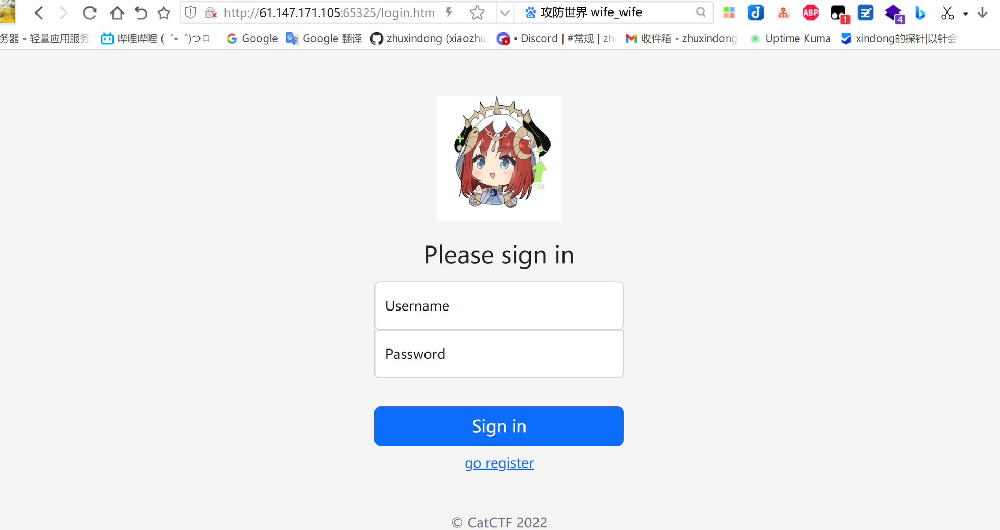
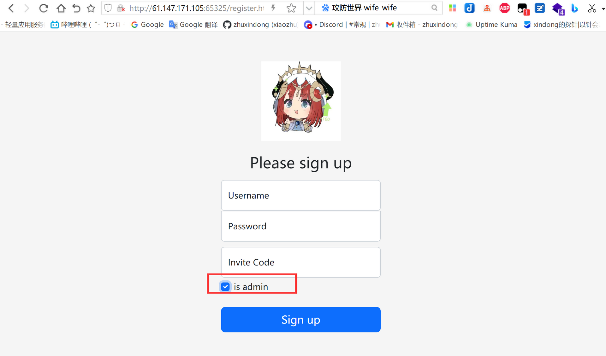
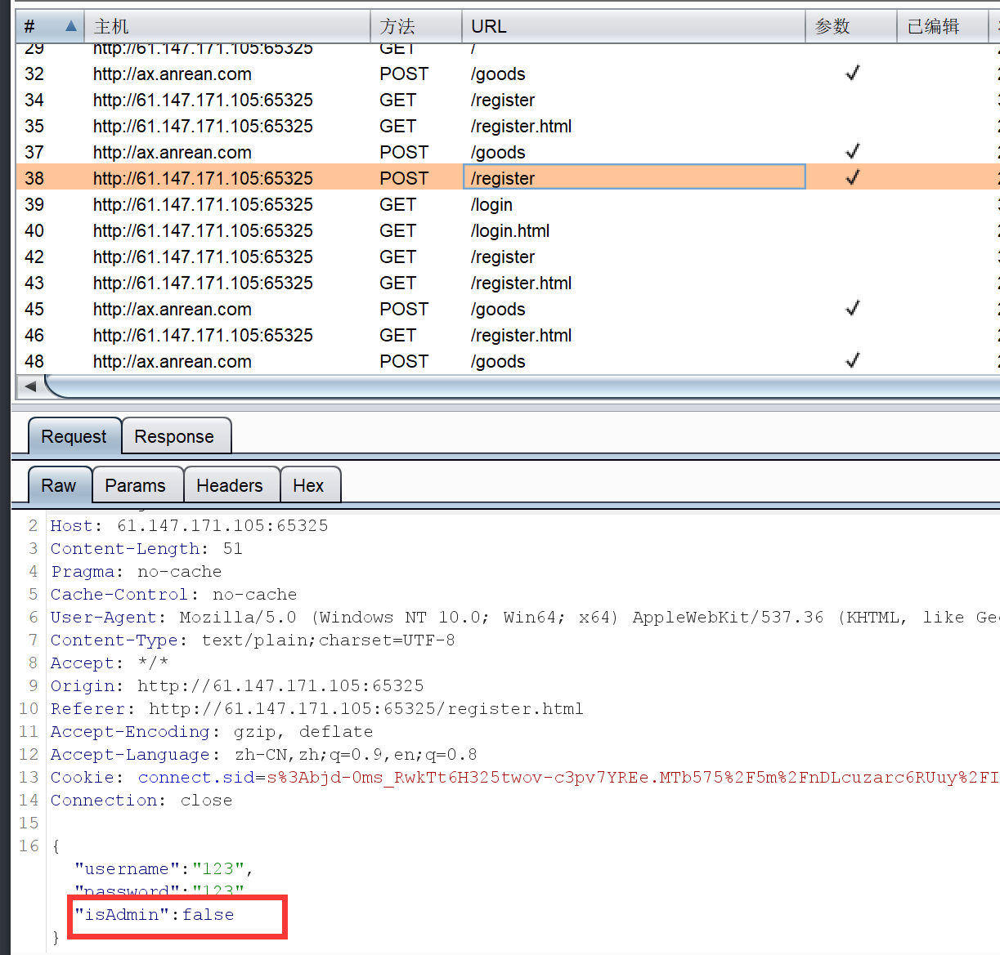

# WEB-攻防世界wife_wife

- 关键词 JavaScript原型链污染
## 1.题目描述

只有一个简单的注册登录界面，没有别的多余信息，尝试Sql注入也无注入点



## 2.解题步骤

从注册界面看，有个isadmin的标志



从burp抓包来看，有个isadmin的字段



尝试直接修改为true是不行的，后来看了wp才知道是JavaScript原型链攻击

（当时题目是黑盒的条件，师傅们可以通过 fuzz 得到有用的信息，因为在后面题目还是 0 解的情况下我们放出了 hint：后端某处采用了 Object.assign()）

## 关于原型链攻击的原理
见 https://www.leavesongs.com/PENETRATION/javascript-prototype-pollution-attack.html

## 3.paylod

```json
"__proto__":{"isAdmin":true}
```

直接抓包修改就行了，提示注册成功，登录之后直接能看到flag了
